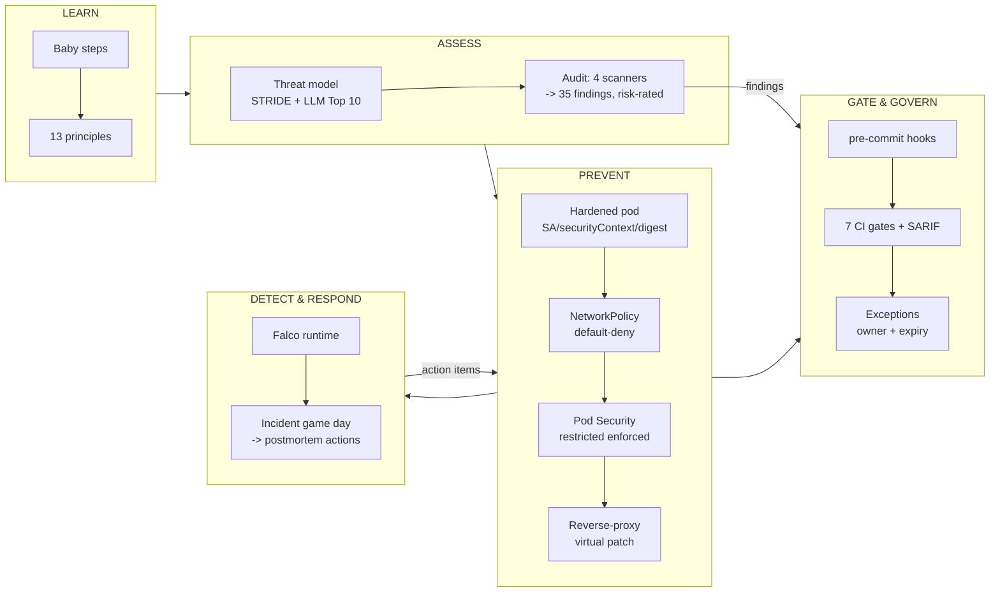

# Project Flow: How Everything Fits, End to End

The one page that documents the whole flow: how the lab is built, the security lifecycle it implements, and how to rebuild or tear it
down. For the map of every file see the [INDEX](../INDEX.md); for what it proves see [security-in-practice](security-in-practice.md).

## The security lifecycle this lab implements



## Build / rebuild the lab (everything is code)

```bash
make cluster-up      # 3-node kind cluster (~1 min)
make deploy          # Juice Shop (hardened manifest) + NetworkPolicy
make open            # http://localhost:3000 VIA the hardened proxy (blocks /ftp, /metrics, keys...)
make falco-up        # runtime detection (optional; ~0.5 GiB)
make ci              # manifests, custom resources, links, INDEX completeness
make security-scan   # the 7 blocking gates (gitleaks, semgrep, custom SAST, trivy, checkov, exceptions, kyverno)
```
Because every control is in Git, a full rebuild takes ~2 minutes. Nothing depends on manual cluster state.

## Tear down / stop all cost (done at wrap-up 2026-09-26)

```bash
make cluster-down    # deletes the kind cluster (Falco, proxy, app, port-forwards all go with it)
# or precisely:
kind delete cluster --name secops-lab
pkill -f "port-forward"
```
**Cloud:** this project never created any Azure or AWS resources — the Azure Terraform ([infra/azure](../infra/azure/)) was only ever
`validate`d and Checkov-scanned (free); `make az-up` was never run, so there is **no** `secops-lab-rg` and no state file. Nothing to
delete, no ongoing cost. If you later run `make az-up`, always finish with `make az-down`.

## What runs where (cost)

| Component | Where | Cost |
|---|---|---|
| kind cluster, Juice Shop, proxy, NetworkPolicy, Pod Security, Falco | Local Docker Desktop | Free (RAM/CPU only, while up) |
| CI + security gates + SARIF reporting | GitHub Actions | Free (public repo) |
| Azure secure-AKS lab | Would be AKS + Key Vault | ~$0.30–0.50/hr **only if** `make az-up` — never run here |

## The 13 lab guides (execution record)
0 [Foundation](labs/lab-00-foundation.md) · 1 [CIA/risk](labs/lab-01-cia-and-risk.md) · 2 [Threat model](labs/lab-02-threat-modeling.md) ·
3 [Attack surface/defaults](labs/lab-03-attack-surface-and-defaults.md) · 4 [Least privilege](labs/lab-04-least-privilege.md) ·
5 [Defence in depth](labs/lab-05-defense-in-depth.md) · 6 [Virtual patch](labs/lab-06-virtual-patch-proxy.md) ·
7 [SAST/supply chain](labs/lab-07-sast-supply-chain.md) · 8 [Pre-commit/baselines](labs/lab-08-precommit-and-baselines.md) ·
9 [AI review](labs/lab-09-ai-security.md) · 10 [Runtime detection](labs/lab-10-runtime-detection.md) ·
11 [Incident game day](labs/lab-11-incident-game-day.md) · 12 [AI testing/process](labs/lab-12-ai-testing-and-process.md)

## Where to take it next
1. **Fork + GHCR build** (needs you): resolves the Critical finding for real (rotate F-013/F-015 keys), fixes F-016 in code, closes EXC-006. Pipeline is ready in [build-sign.yml](../.github/workflows/build-sign.yml).
2. **Azure Phase 2** (needs `az login`, small cost): the [cloud labs](cloud/README.md) AZ-1…AZ-8.
3. **Lab 12.2 audit logging** (local, needs a cluster rebuild with an API-server audit policy).
4. **Principles 08/09 remaining labs** (identity deep-dive, secret rotation) — mostly enabled by the fork.
