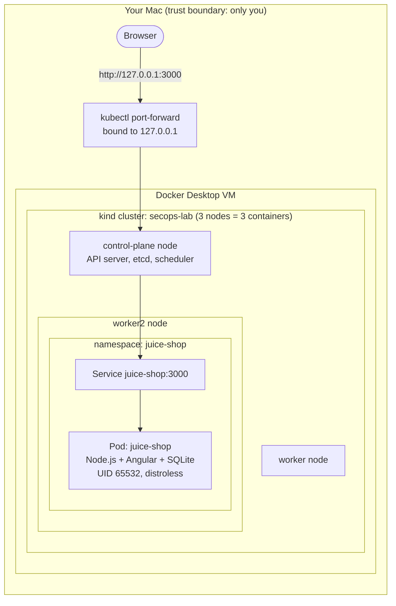
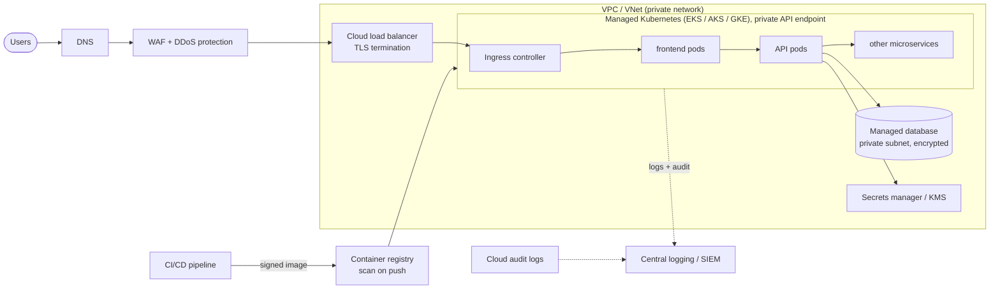

# Securing the Stack: Cloud, Kubernetes, Containers, Pods and Microservices

The [principles](../principles/README.md) tell you *what* to achieve. This page shows *where* each one applies in a modern
application stack, layer by layer, using the Kubernetes **4C model**: **Cloud → Cluster → Container → Code.**
Each layer can only be as secure as the one beneath it. A perfectly written app on a cluster with an open API server is not secure.

## Contents
1. [How the lab runs today](#1-how-the-lab-runs-today)
2. [The same app in a real cloud](#2-the-same-app-in-a-real-cloud)
3. [Layer 1: Cloud](#3-layer-1-cloud)
4. [Layer 2: Kubernetes cluster](#4-layer-2-kubernetes-cluster)
5. [Layer 3: Containers and pods](#5-layer-3-containers-and-pods)
6. [Layer 4: Code and application](#6-layer-4-code-and-application)
7. [Microservices: securing east-west traffic](#7-microservices-securing-east-west-traffic)
8. [Where each layer is practised](#8-where-each-layer-is-practised)
9. [Interview questions](#9-interview-questions)

---

## 1. How the lab runs today



| Component | What it is here | Security-relevant detail |
|---|---|---|
| **Node** | A Docker container pretending to be a machine (kind) | Real clusters use VMs; node compromise = every pod on it |
| **Control plane** | API server, etcd (the cluster database), scheduler, controllers | The API server is the front door to *everything*; etcd holds all Secrets |
| **Namespace** `juice-shop` | Logical boundary for the app | Where RBAC, Pod Security and NetworkPolicy are applied |
| **Deployment** | Keeps 1 replica of the pod running | Its pod template is where the securityContext lives |
| **Pod** | The running container(s) | Gets a service-account token by default (F-001) |
| **Service** | A stable internal address (`juice-shop.juice-shop.svc:3000`) | Internal only: type `ClusterIP`, not exposed outside |
| **Port-forward** | A tunnel from your laptop to the Service | Bound to `127.0.0.1`: our only "ingress" |

Juice Shop is a **monolith** (one service: API, frontend and database in one container). That keeps the AppSec lessons clear.
For microservice lessons, see [section 7](#7-microservices-securing-east-west-traffic).

---

## 2. The same app in a real cloud



**Shared responsibility:** with managed Kubernetes, the cloud provider secures the control plane's infrastructure.
**You** still own IAM, network exposure, node configuration (partly), workloads, images, RBAC, data and detection.
Most cloud breaches come from the customer's side: misconfiguration and over-privileged identities.

---

## 3. Layer 1: Cloud

| Area | Risk | Controls | Principle |
|---|---|---|---|
| **Identity (IAM)** | Over-privileged roles; long-lived access keys | Per-workload roles, no static keys, **workload identity** (IRSA / EKS Pod Identity, Azure Workload Identity, GKE Workload Identity), MFA and SSO for humans | [03](../principles/03-least-privilege.md), [08](../principles/08-identity-and-access.md) |
| **Instance metadata service** | SSRF from a pod steals node credentials (the Capital One pattern) | IMDSv2 with hop limit 1 (AWS), block metadata IP from pods via NetworkPolicy, workload identity instead of node roles | [03](../principles/03-least-privilege.md), [07](../principles/07-never-trust-input.md) |
| **Network** | Public databases, open security groups, public Kubernetes API | Private subnets, security groups / NSGs with least access, **private API endpoint** or IP allow-list, egress control | [04](../principles/04-defense-in-depth.md), [05](../principles/05-attack-surface-reduction.md) |
| **Data** | Public buckets, unencrypted snapshots | Block public access by default, KMS encryption, key rotation, backup isolation | [09](../principles/09-protect-data-and-secrets.md) |
| **Logging** | No record of who did what | Cloud audit logs (CloudTrail / Azure Activity Log / Cloud Audit Logs) on, centralised, immutable | [12](../principles/12-assume-breach.md) |
| **Posture** | Drift and misconfiguration at scale | Infrastructure as code (Terraform) + IaC scanning, CSPM (e.g. Security Hub, Defender for Cloud), policy guardrails (SCPs / Azure Policy) | [11](../principles/11-shift-left-automation.md) |

---

## 4. Layer 2: Kubernetes cluster

| Component | Risk | Controls |
|---|---|---|
| **API server** | Anonymous or public access; stolen kubeconfig | Private endpoint, authentication via OIDC/SSO, anonymous auth off, short-lived credentials |
| **RBAC** | `cluster-admin` handed out, wildcard verbs, `get secrets` everywhere | Namespaced Roles, no wildcards, regular review (`kubectl auth can-i --list`), tools like `rbac-tool` / Kubescape |
| **etcd** | Holds every Secret, only Base64-encoded | Encryption at rest with a KMS provider, no network access except from the API server |
| **Admission control** | Anything can be deployed | **Pod Security Admission** (`restricted`), **Kyverno** or OPA Gatekeeper policies (signed images, no `:latest`, required limits) |
| **Nodes / kubelet** | Node compromise = all pods on it; kubelet API abuse | Minimal node OS, auto-patching, kubelet anonymous auth off, no SSH, CIS benchmark (`kube-bench`) |
| **Network** | Flat pod network; lateral movement | Default-deny **NetworkPolicy**, a CNI that enforces it, egress restrictions |
| **Audit** | No record of `exec`, Secret reads, RBAC changes | API audit logging to central storage, alerts on sensitive verbs |
| **Upgrades** | Known CVEs in Kubernetes itself | Stay within supported versions (roughly the last 3 minor releases) |

Useful posture scanners: [Kubescape](https://kubescape.io/) (NSA/CISA and CIS frameworks), [kube-bench](https://github.com/aquasecurity/kube-bench) (CIS benchmark),
`trivy k8s` (misconfigurations + vulnerabilities in a live cluster).

---

## 5. Layer 3: Containers and pods

**Image** (build time):

| Practice | Why |
|---|---|
| Minimal base (distroless, Alpine, scratch) | Fewer packages = fewer CVEs and no tools for an attacker |
| Multi-stage builds | Compilers and build secrets stay out of the final image |
| Non-root `USER` in the Dockerfile | Safe even if the pod spec forgets `runAsNonRoot` |
| Scan (Trivy/Grype), SBOM (Syft), sign (Cosign) | Know what's inside and prove where it came from ([10](../principles/10-supply-chain-integrity.md)) |
| Pin by digest | A tag can be moved to a different image; a digest can't |
| No secrets in images or `ENV` | Anyone who can pull the image can read its layers |

**Pod spec** (run time): the hardened target for our Juice Shop manifest, built up in Labs 3.1, 3.2 and 4.2:

```yaml
spec:
  serviceAccountName: juice-shop            # dedicated identity, not "default"
  automountServiceAccountToken: false        # no Kubernetes API token (F-001)
  securityContext:
    runAsNonRoot: true
    seccompProfile: {type: RuntimeDefault}   # filter dangerous syscalls
  containers:
    - name: juice-shop
      image: bkimminich/juice-shop@sha256:…  # digest-pinned (F-009)
      securityContext:
        allowPrivilegeEscalation: false      # no setuid tricks (F-002)
        readOnlyRootFilesystem: true         # attacker can't write tools to disk
        capabilities: {drop: ["ALL"]}
      resources:
        limits: {memory: 512Mi}              # availability: one pod can't starve the node
```

**Pod Security Standards**, the three built-in levels enforced per namespace:

| Level | Allows | Use for |
|---|---|---|
| `privileged` | Everything | System components only (CNI, CSI, monitoring agents) |
| `baseline` | Blocks known privilege escalations (host namespaces, privileged containers, hostPath) | Legacy apps on the way to restricted |
| `restricted` | Requires non-root, dropped capabilities, seccomp, no privilege escalation | **All application workloads** (our target) |

**Container escape** risks to know: `privileged: true`, `hostPath` mounts (especially `/` or the container runtime socket),
`hostPID`/`hostNetwork`, `CAP_SYS_ADMIN`, and unpatched kernels. Each is blocked by `restricted`.

---

## 6. Layer 4: Code and application

This is where principles [07](../principles/07-never-trust-input.md), [08](../principles/08-identity-and-access.md),
[09](../principles/09-protect-data-and-secrets.md) and [13](../principles/13-ai-era-security.md) apply: input handling,
authentication, authorisation, secrets, dependencies and AI features. Juice Shop provides most of its lessons here.
The lower layers can **limit the damage** of a code flaw (a read-only filesystem, no API token, default-deny egress), but they
can't fix it.

---

## 7. Microservices: securing east-west traffic

Splitting a monolith into services turns function calls into **network calls**. Each one is now something to authenticate,
authorise, encrypt and log. Traffic *into* the system is **north-south**; traffic *between* services is **east-west**, and it's
where attackers move laterally after an initial foothold.

| Concern | Monolith | Microservices | Controls |
|---|---|---|---|
| Service-to-service identity | Not needed | Every call needs "who is calling?" | **mTLS** with workload identities (a service mesh like Istio or Linkerd, or SPIFFE/SPIRE) |
| Authorisation between services | In-process | "Should *checkout* be allowed to call *payment*?" | Mesh authorisation policies + NetworkPolicy (allow-list per service pair) |
| End-user identity | One session | Must be propagated across hops | Validate a signed token (JWT) at the gateway **and** in each service; never trust a plain `X-User-Id` header |
| Entry point | One app | Many APIs | **API gateway**: authentication, rate limiting, schema validation at the edge |
| Secrets | One set | One set per service | Per-service secrets and database users; a compromise of one doesn't unlock all |
| Supply chain | One image | Dozens of images, many languages | SBOM, scanning and signing for *every* image; admission policy enforces it |
| Detection | One log stream | Requests span many services | Central logs + distributed tracing with correlation IDs, so one attack path can be followed across services |
| Blast radius | Whole app | Can be one service, **if** the above are in place | Otherwise it's still the whole app, just harder to see |

**Zero trust** in one line: no call is trusted because it comes from "inside the cluster". Every request is authenticated,
authorised and encrypted.

**Lab option:** for east-west labs (NetworkPolicy between services, mTLS, per-service identity), the
[OpenTelemetry Astronomy Shop](https://opentelemetry.io/docs/demo/) from your SRE lab has 15+ services in 10+ languages and can
be deployed into this same cluster (it needs ~8 GB more RAM). This is planned as an extension of [Principle 04](../principles/04-defense-in-depth.md).

---

## 8. Where each layer is practised

| Layer | Labs in this repo | Runs on |
|---|---|---|
| Cloud | Cloud-extension labs (planned): workload identity, IMDS protection, private API endpoint, cloud audit logs, CSPM findings | AKS or EKS (costs money: create, practise, **destroy** the same day) |
| Cluster | 3.3 RBAC · 4.2 Pod Security · 9.2 etcd encryption · 10.3 admission policy · 12.2 audit logging · Kubescape / kube-bench scans | kind (free) |
| Container / pod | 3.1 service account · 3.2 securityContext · 5.2 image surface · 10.1–10.3 SBOM, scan, sign | kind (free) |
| Code | 7.1–7.3 SAST and fixes · 8.1–8.3 authn/authz · 9.1 secrets · 13.1–13.3 AI feature | kind (free) |
| Microservices | 4.1 NetworkPolicy · Astronomy Shop extension: east-west policy and mTLS (planned) | kind (free) |
| Across all layers | 11.1–11.3 CI gates · 12.1 runtime detection · 12.3 incident game day | kind (free) + GitHub Actions |

---

## 9. Interview questions
1. Explain the 4C model. Give one control per layer.
2. What does the cloud provider secure in managed Kubernetes, and what do you still own?
3. A pod is compromised through an app vulnerability. Walk through what limits the damage, layer by layer.
4. How does a pod get cloud credentials securely? Why are node-level roles risky?
5. What makes a container "privileged", and why can that lead to a node takeover?
6. Explain the three Pod Security Standards levels, and how you'd migrate a namespace to `restricted`.
7. How do microservices authenticate to each other? What does a service mesh add?
8. What is east-west traffic, and why do attackers care about it?
9. Why must each microservice re-validate the user's token instead of trusting the gateway?
10. How would you secure a Kubernetes API server for a production cluster?
