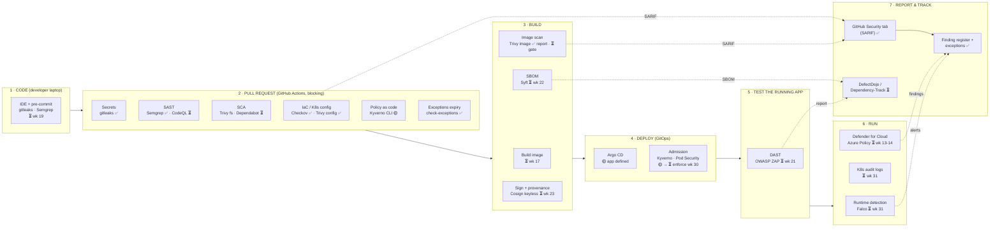
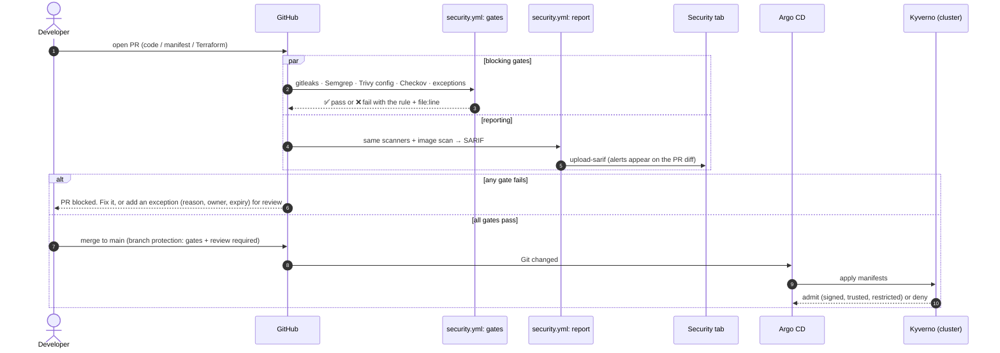
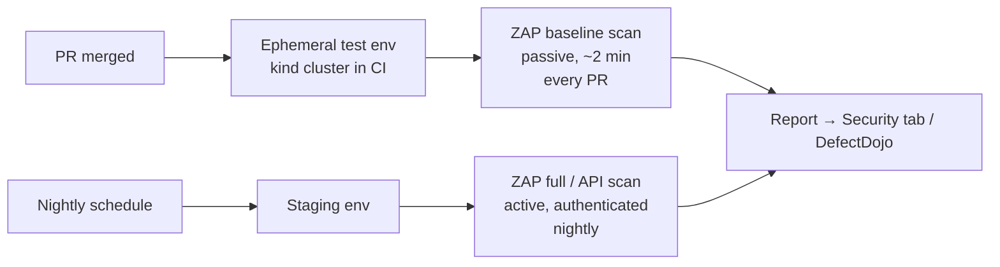
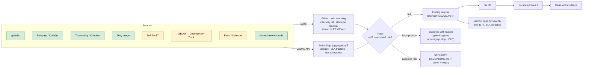

# DevSecOps Toolchain: How the Tools Fit Together

This page shows **which security tool runs where**, **what each one finds**, **whether it blocks**, and **how its findings reach a
human** (vulnerability reporting). Terms like SAST, DAST and SBOM are explained in the [glossary](../GLOSSARY.md).

Legend: ✅ wired and running in this repo · 🟡 written and tested offline · ⏳ planned (the [roadmap](../career/ROADMAP.md) week is given)

## Contents
1. [The whole picture](#1-the-whole-picture)
2. [Stage by stage: what runs, what it finds, does it block?](#2-stage-by-stage)
3. [The life of a pull request](#3-the-life-of-a-pull-request)
4. [SAST vs DAST vs SCA vs IaC vs secrets scanning](#4-sast-vs-dast-vs-sca-vs-iac-vs-secrets-scanning)
5. [DAST: how dynamic testing fits in](#5-dast-how-dynamic-testing-fits-in)
6. [Vulnerability reporting: from finding to fix](#6-vulnerability-reporting-from-finding-to-fix)
7. [Fix-time targets (SLAs) and exceptions](#7-fix-time-targets-slas-and-exceptions)
8. [Where each piece lives in the repo](#8-where-each-piece-lives-in-the-repo)
9. [Interview questions](#9-interview-questions)

---

## 1. The whole picture

**How to read it:** each stage catches problems the earlier stages can't see. SAST reads code but can't see how the running app behaves;
DAST sees the running app but not the code; admission control catches anything that skipped CI; runtime detection catches what
everything else missed. That's [defence in depth](../principles/04-defense-in-depth.md) applied to the delivery pipeline.

---

## 2. Stage by stage

| Stage | Tool | Finds | Output | Blocks? | Status |
|---|---|---|---|---|---|
| **Code** (laptop) | gitleaks pre-commit hook | Secrets before they're committed | Terminal | Yes, locally (can be skipped, so CI repeats it) | ⏳ wk 19 |
| **PR** | **gitleaks** | Secrets in the full git history | SARIF | ✅ **Yes** | ✅ |
| PR | **Semgrep** (SAST) | Insecure code patterns; unpinned or injectable GitHub Actions | SARIF | ✅ **Yes** | ✅ (workflows) · ⏳ app code wk 18 |
| PR | CodeQL (SAST) | Deeper data-flow bugs (source → sink across files) | SARIF | Yes | ⏳ wk 18 |
| PR | **Trivy config** | Kubernetes misconfiguration (root, privileges, no limits) | SARIF | ✅ **Yes** (with expiring exceptions) | ✅ |
| PR | **Checkov** | Terraform/Azure misconfiguration | SARIF | ✅ **Yes** (with expiring exceptions) | ✅ |
| PR | **check-exceptions** | Expired or undocumented exceptions | Text | ✅ **Yes** | ✅ |
| PR | Kyverno CLI | Manifests that admission policy would reject | Text | Report now, blocking at M5 | 🟡 |
| PR | Trivy fs / Dependabot (SCA) | Vulnerable dependencies in `package.json` | SARIF / PRs | Yes, on fixable High/Critical | ⏳ wk 20 |
| **Build** | Trivy image | CVEs in OS packages + libraries inside the image | SARIF | Report now (weekly); blocking on our own image at M2 | ✅ report |
| Build | Syft | SBOM (every component and version) | CycloneDX JSON | No: it's an inventory | ⏳ wk 22 |
| Build | Cosign | Signature + provenance attestation | Stored in the registry | No: it *enables* blocking at admission | ⏳ wk 23 |
| **Deploy** | Argo CD | Drift between Git and the cluster | UI / events | Reverts drift (selfHeal) | 🟡 |
| Deploy | Kyverno admission | Unsigned images, untrusted registries, unsafe pods | Admission deny + policy reports | Yes, in the cluster | 🟡 Audit → ⏳ Enforce wk 30 |
| **Test** | OWASP ZAP (DAST) | Runtime issues: missing headers, cookie flags, CORS, reflected input, errors that leak info | HTML/JSON/SARIF | Baseline on High | ⏳ wk 21 |
| **Run** | Falco | Suspicious behaviour: shell in container, sensitive file reads | Alerts | No: detect and respond | ⏳ wk 31 |
| Run | Defender for Cloud, Azure Policy | Cloud posture, container threats | Portal / alerts | Policy can deny | ⏳ wk 13–14 |

---

## 3. The life of a pull request

---

## 4. SAST vs DAST vs SCA vs IaC vs secrets scanning

| | **SAST** | **DAST** | **SCA** | **IaC scanning** | **Secrets scanning** |
|---|---|---|---|---|---|
| Looks at | Your source code | The **running** app, from outside | Your dependencies | Terraform, K8s YAML, Dockerfiles | Code + full git history |
| Needs the app running? | No | **Yes** | No | No | No |
| Finds | Injection patterns, unsafe APIs, hard-coded keys | Missing headers, auth/session issues, reflected input, misconfig as deployed | Known CVEs in libraries | Public buckets, root pods, open networks | API keys, private keys, tokens |
| Misses | Runtime config; issues that span services | Code it never reaches; exact code location | Your own code; unknown (0-day) flaws | Drift after deploy | Secrets split up or encoded oddly |
| False positives | Medium–high: triage needed | Low–medium | Low (but "reachable?" matters) | Low–medium | Medium (test fixtures) |
| When | Every PR (fast) | After deploy to a test env (slower) | Every PR + continuously | Every PR | Pre-commit + every PR |
| This lab | Semgrep ✅, CodeQL ⏳ | ZAP ⏳ | Trivy ✅ (image), Dependabot ⏳ | Checkov ✅, Trivy config ✅ | gitleaks ✅ |
| Juice Shop example | F-016 SQL injection found in `routes/login.ts` | F-007 CORS `*`, F-008 no CSP seen in responses | F-017: 53 High/Critical CVEs | F-001, F-002 manifest issues | F-010 JWT private key in source |

**No single tool is enough.** The Juice Shop audit showed it: Semgrep found the SQL injection, only the *live request* proved the Terraform
key was downloadable (F-013), and only Trivy saw the 53 dependency CVEs.

---

## 5. DAST: how dynamic testing fits in

DAST (dynamic application security testing) sends real HTTP requests to a **running** instance and looks at the responses. It sees the
app the way an attacker does, including configuration that only exists at runtime.

| Mode | What it does | When | Safe for |
|---|---|---|---|
| **Baseline** (passive) | Crawls and *observes* responses: headers, cookies, info leaks. Sends no attacks | Every PR, against an ephemeral environment | Any environment you own |
| **Full / active** | Sends attack payloads to find injection etc. | Nightly, against staging | **Only** test environments you own. Never production without approval |
| **API scan** | Uses the OpenAPI spec to test every endpoint | Nightly | Test environments |
| **Authenticated** | Logs in first, to test pages behind the login | Nightly | Test environments, with a test account |

**Rules:** only scan systems you own or are authorised to test ([security-way.md](../security-way.md)); run active scans against
disposable environments; tune out known false positives with a rules file, just like the SAST baseline.

**Planned for this repo (roadmap week 21):** a workflow job that starts a kind cluster, deploys Juice Shop, runs the ZAP baseline scan against
it, and uploads the report. The findings it should reproduce are already known from the manual audit (F-007, F-008), which is a good way to
check that the tool works.

---

## 6. Vulnerability reporting: from finding to fix

Scanners are only useful if findings reach someone who fixes them, get deduplicated, and are tracked to closure.

| Piece | Role | Status |
|---|---|---|
| **SARIF** | Standard JSON format for static-analysis results; every scanner here can produce it | ✅ [security-report.sh](../../scripts/security-report.sh) |
| **GitHub code scanning** | Shows alerts in the Security tab and on PR diffs; tracks open/fixed/dismissed (with a reason) | ✅ `report` job in [security.yml](../../.github/workflows/security.yml) (free for public repos) |
| **Finding register** | The human-curated list: risk in context, owner, status, evidence | ✅ [findings/README.md](../../findings/README.md) |
| **Exceptions register** | Accepted risks with expiry, enforced by CI | ✅ [SECURITY-EXCEPTIONS.md](../../SECURITY-EXCEPTIONS.md) |
| **DefectDojo** | Open-source vulnerability management: imports 150+ scanner formats, deduplicates, tracks SLAs | ⏳ Phase 3 stretch |
| **Dependency-Track** | Stores SBOMs and re-checks them against new CVEs every day, so old releases get new alerts | ⏳ with the SBOM (wk 22) |

**Why the weekly scheduled run matters:** an image that hasn't changed can still gain new CVEs, because new vulnerabilities are published
every day. The `schedule:` trigger in the workflow re-scans every Monday and surfaces them, even when nobody pushes code.

---

## 7. Fix-time targets (SLAs) and exceptions

A common, defensible policy (adjust to your organisation's risk appetite):

| Severity (after triage, in context) | Fix within | If not fixed in time |
|---|---|---|
| Critical, or on the CISA KEV list | **7 days** (exposed systems: 24–72 h) | Escalate to the service owner and security lead |
| High | 30 days | Exception needed (reason, owner, expiry) |
| Medium | 90 days | Exception needed |
| Low | Best effort / next refactor | Tracked |

**Against the current audit:** F-013 (Critical) would already be under the 7-day clock; the 8 Highs under the 30-day clock.

---

## 8. Where each piece lives in the repo

| Piece | File |
|---|---|
| Blocking gates (local = CI) | [scripts/security-scan.sh](../../scripts/security-scan.sh) · `make security-scan` |
| SARIF reporting | [scripts/security-report.sh](../../scripts/security-report.sh) |
| Workflow (gates + report, weekly schedule) | [.github/workflows/security.yml](../../.github/workflows/security.yml) |
| Scanner install (pinned, checksum-verified) | [scripts/ci-install-scanners.sh](../../scripts/ci-install-scanners.sh) |
| Expiring exceptions | [SECURITY-EXCEPTIONS.md](../../SECURITY-EXCEPTIONS.md) · [.trivyignore](../../.trivyignore) · [check-exceptions.py](../../scripts/check-exceptions.py) |
| Verified false positives | [.gitleaksignore](../../.gitleaksignore) |
| Admission policies | [platform/kyverno/](../../platform/kyverno/) |
| GitOps | [gitops/apps/](../../gitops/apps/) |
| Cloud (IaC) | [infra/azure/](../../infra/azure/) |

---

## 9. Interview questions
1. Walk me through a DevSecOps pipeline: which tools run where, and which ones block?
2. SAST vs DAST: what does each find that the other can't? Give an example of each.
3. Why is DAST usually run after deployment and not on every commit? How would you still get fast feedback?
4. What is SARIF, and why does a common format matter?
5. A scanner reports 500 findings on day one. How do you roll out the gate without blocking every team?
6. How do you make sure accepted risks don't become permanent?
7. An image hasn't changed in 3 months. Why could it have new critical vulnerabilities, and how would you know?
8. Where does an SBOM fit, and what do you do with it after the build?
