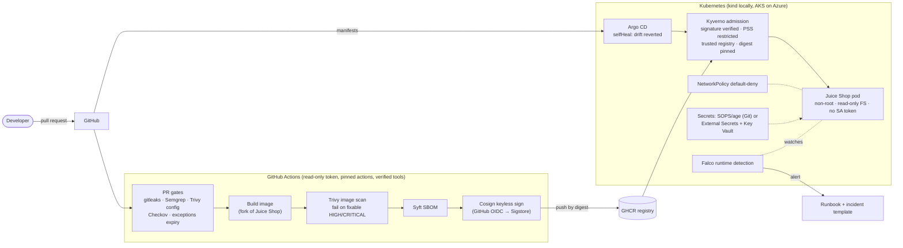

# Capstone: A GitOps Pipeline, Hardened End to End

**The portfolio project for the roadmap** ([Phase 5](../career/ROADMAP.md#phase-5-portfolio-and-job-search-weeks-3336)). It ships the audited
Juice Shop (with the fixes from the [remediation plan](../../findings/REMEDIATION.md)) through a pipeline where **every step is a security
control**, and the cluster refuses anything that didn't come through it.

> **For reviewers (2-minute version):** a pull request that adds a secret, a vulnerable dependency, string-built SQL or a privileged pod
> is **blocked in CI**. Images that pass are scanned, given an SBOM and **signed keylessly** by GitHub Actions. Argo CD deploys only from
> Git, and Kyverno **rejects any image this pipeline didn't sign**. Falco alerts on suspicious runtime behaviour. Every exception is
> documented and **expires**.

## Architecture

Tool-by-tool detail (what each finds, whether it blocks, how findings are reported): [DevSecOps toolchain](../architecture/devsecops-toolchain.md).



## Security decisions

Each control has a one-line "why". In interviews, the "why" matters more than the tool name.

| # | Control | Why (threat it addresses) | Principle | Status |
|---|---|---|---|---|
| 1 | Security gates on every PR, all blocking | Catch secrets, injection, misconfig and vulnerable deps before merge, when they're cheapest to fix | [11](../principles/11-shift-left-automation.md) | ✅ [security.yml](../../.github/workflows/security.yml) |
| 2 | Exceptions with expiry dates, enforced by CI | Accepted risk that never expires becomes permanent risk | [01](../principles/01-cia-triad-and-risk.md) | ✅ [SECURITY-EXCEPTIONS.md](../../SECURITY-EXCEPTIONS.md) |
| 2b | Vulnerability reporting: SARIF from every scanner → GitHub code scanning, weekly re-scan | New CVEs appear daily, even for unchanged images; findings must reach a human | [12](../principles/12-assume-breach.md) | ✅ `report` job |
| 3 | Pipeline hardening: read-only token, actions pinned by SHA, tool checksums verified | The pipeline holds the keys to production, so it's a prime supply-chain target | [10](../principles/10-supply-chain-integrity.md) | ✅ |
| 4 | Secure-by-default cloud in Terraform, scanned by Checkov | Misconfiguration is the top cause of cloud breaches | [cloud](../cloud/README.md) | ✅ written + validated; ⏳ applied |
| 5 | Build from a fork with fixes | Fix the audit's High findings in code, not just at the edge | [07](../principles/07-never-trust-input.md), [08](../principles/08-identity-and-access.md) | ⏳ M2 |
| 6 | SBOM per image | Answer "do we ship library X?" in minutes (Log4Shell) | [10](../principles/10-supply-chain-integrity.md) | ⏳ M3 |
| 7 | Keyless signing + provenance | Prove the image came from this repo's workflow, unmodified | [10](../principles/10-supply-chain-integrity.md) | ⏳ M3 |
| 8 | No plaintext secrets: SOPS/age in Git, Key Vault via workload identity on AKS | Secrets in Git are leaked secrets | [09](../principles/09-protect-data-and-secrets.md) | ⏳ M4 |
| 9 | GitOps with self-heal | Git is the only change path; manual drift is reverted | [11](../principles/11-shift-left-automation.md) | 🟡 [app defined](../../gitops/apps/juice-shop.yaml) |
| 10 | Kyverno admission: signatures, PSS restricted, registries, digests | Enforced in the cluster even if CI is bypassed | [04](../principles/04-defense-in-depth.md) | 🟡 [policies](../../platform/kyverno/) written, CLI-tested (Audit) |
| 11 | Hardened pod + default-deny network | Limit the blast radius of an app compromise | [03](../principles/03-least-privilege.md), [04](../principles/04-defense-in-depth.md) | ⏳ M5 (A1–A3) |
| 11b | DAST: ZAP baseline against an ephemeral kind environment on each PR; full scan nightly | Finds runtime issues SAST can't see (headers, cookies, CORS as deployed) | [06](../principles/06-secure-defaults.md) | ⏳ week 21 |
| 12 | Falco runtime detection + runbooks | Prevention fails eventually; notice and respond | [12](../principles/12-assume-breach.md) | ⏳ M6 |

## Milestones

| Milestone | Roadmap week | Done when | Status |
|---|---|---|---|
| **M0: Foundations** | now | PR gates blocking; exceptions expire; Terraform validated; Kyverno policies tested offline; Argo CD app defined | ✅ 2026-09-26 |
| **M1: Secure cloud foundation** | 16 | `make az-up` creates the environment; Checkov clean (with only documented exceptions); labs AZ-1…AZ-8 done | ⏳ |
| **M2: PR gates on the app** | 21 | Fork builds in CI; SAST/SCA/secrets gates on the fork; C2, C3, C5 fixes merged | ⏳ |
| **M3: Signed images with SBOM** | 23 | Every image has an SBOM and a keyless signature; `cosign verify` passes | ⏳ |
| **M4: No plaintext secrets** | 24 | SOPS/age for GitOps secrets; External Secrets + Key Vault on AKS | ⏳ |
| **M5: Admission enforced** | 30 | Kyverno in Enforce; unsigned image rejected; manifest hardened (EXC-005 closed) | ⏳ |
| **M6: Runtime detection** | 31 | Falco alert on a shell in the pod, triaged with a runbook | ⏳ |
| **M7: Write-up and demo** | 33–34 | This page final; 5-minute demo video | ⏳ |

## Run what exists today

```bash
make security-scan      # all six gates locally (gitleaks, Semgrep, Trivy config, Checkov, exceptions, Kyverno report)
make ci                 # manifests, custom resources, links
make az-plan            # free: see what the secure Azure lab would create (needs infra/azure/terraform.tfvars)
```

## Known trade-offs (say these before an interviewer does)
- Kyverno 1.19 marks `ClusterPolicy` as deprecated in favour of CEL-based `ValidatingPolicy`. The policies still work; migrating them is a Phase 4 exercise.
- The AKS API and Key Vault use **IP allow-lists instead of private networking** (EXC-001) to avoid VPN/bastion cost. The trade-off is documented, and it expires.
- Juice Shop stays intentionally vulnerable in places. The goal is zero **unmanaged** risk, not zero findings ([why](../../findings/REMEDIATION.md#2-what-zero-security-flags-means-here)).
