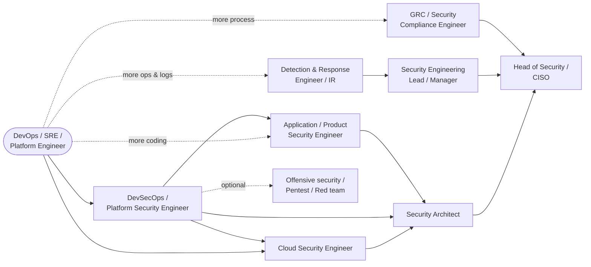
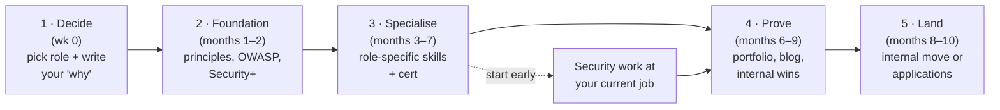

# Career Pathways: From DevOps/SRE into Security Roles

How a DevOps or SRE engineer moves into **DevSecOps, Cloud Security, Application Security, Detection & Response, GRC** and beyond: which
role fits you, what transfers, what to learn, how to prove it, and how to land the job.

← [Career study guide](README.md) · The week-by-week plan: [ROADMAP.md](ROADMAP.md) · Portfolio: [capstone](../capstone/README.md)

## Contents
1. [You're closer than you think: what transfers](#1-youre-closer-than-you-think-what-transfers)
2. [The pathway map](#2-the-pathway-map)
3. [Choose your target role](#3-choose-your-target-role)
4. [Role-by-role plans](#4-role-by-role-plans)
5. [The universal transition plan (5 stages)](#5-the-universal-transition-plan-5-stages)
6. [Ways in: internal move, hybrid role, external](#6-ways-in-internal-move-hybrid-role-external)
7. [Your first 90 days in a security role](#7-your-first-90-days-in-a-security-role)
8. [Long-term career ladder](#8-long-term-career-ladder)
9. [Advice from experienced security engineers](#9-advice-from-experienced-security-engineers)
10. [Common mistakes](#10-common-mistakes)
11. [Self-assessment checklist](#11-self-assessment-checklist)

---

## 1. You're closer than you think: what transfers

Security teams struggle to hire people who understand **how production actually works**. That's your advantage.

| DevOps / SRE skill you have | Why security needs it | Where it becomes security work |
|---|---|---|
| CI/CD pipelines | Security gates, pipeline hardening and supply-chain security all live here | DevSecOps: SAST/SCA/secrets gates, signing ([toolchain](../architecture/devsecops-toolchain.md)) |
| Kubernetes and containers | Most modern attack surface; admission control and runtime detection | K8s security, CKS, Kyverno, Falco |
| Terraform / IaC | Cloud misconfiguration is the #1 cloud risk | IaC scanning, secure modules, guardrails |
| Cloud (Azure/AWS) | Identity is the new perimeter | Cloud security: IAM, network, KMS, posture |
| Linux administration | Hardening, forensics, detection | [Linux security](../linux-security/README.md), incident response |
| Monitoring, logging, alerting | Detection engineering is alerting on attacker behaviour | SIEM rules, Falco, audit logs |
| Incident response, on-call, postmortems | Security incidents use the same lifecycle | Security IR, game days ([Principle 12](../principles/12-assume-breach.md)) |
| Automation and scripting | Security at scale needs automation | Security tooling, SOAR, policy as code |
| Working with developers | Security succeeds only if developers adopt it | Security champions, low-friction guardrails |

**The gap to close:** security *thinking* (threat modelling, attacker techniques, risk), application-security fundamentals (OWASP Top 10,
authentication and authorisation), and the vocabulary ([glossary](../GLOSSARY.md)). That's roughly what [Phase 1](ROADMAP.md#phase-1-security-fundamentals-weeks-16) covers.

---

## 2. The pathway map

**Closest moves** (6–10 months with steady study): **DevSecOps** and **Cloud Security**. **Next closest** (9–15 months): AppSec (needs
stronger coding and code review) and Detection & Response (needs attacker-technique knowledge and log analysis). **Different track:**
offensive security (pentesting) usually takes longer and values different certifications (OSCP).

---

## 3. Choose your target role

| If you enjoy… | Target role | Your DevOps overlap |
|---|---|---|
| Building pipelines and platforms that make the secure way the easy way | **DevSecOps / Platform Security Engineer** | ●●●●● |
| Cloud architecture, IAM, networking, Terraform | **Cloud Security Engineer** | ●●●●○ |
| Reading code, working closely with developers, finding bugs | **Application / Product Security Engineer** | ●●●○○ |
| Logs, alerts, incidents, investigating "what happened" | **Detection & Response / SOC / IR Engineer** | ●●●○○ |
| Structure, policies, audits, explaining risk to the business | **GRC / Security Compliance Engineer** | ●●○○○ |
| Breaking things, puzzles, thinking like an attacker | **Penetration Tester / Red Team** | ●●○○○ |
| Big-picture design across many teams | **Security Architect** (a later step, not a first move) | ●●●○○ |

**Recommended for you:** start with **DevSecOps**, with **Cloud Security (Azure)** as your second strength. That's exactly what the
[roadmap](ROADMAP.md) and [capstone](../capstone/README.md) are built around, and it keeps both doors open.

---

## 4. Role-by-role plans

Each plan uses the same four stages: **Foundation → Specialise → Prove → Land**. Weeks refer to the [roadmap](ROADMAP.md).

### 4.1 DevSecOps / Platform Security Engineer ⭐ recommended first move

**The job:** make secure delivery the default: security gates in CI/CD, supply-chain security, secrets management, hardened base images and
clusters, policy as code, and helping developers fix findings. Often sits in the platform team or the security team.

**A typical week:** tune a noisy SAST rule; review a Terraform PR for IAM scope; roll out image signing to three more services; help a team fix
a critical CVE; add a Kyverno policy after an incident; report vulnerability SLA metrics.

| Stage | Focus | Do in this repo | Proof |
|---|---|---|---|
| **Foundation** (wks 1–6) | Principles 01–09, OWASP Top 10, STRIDE, crypto | Labs 0–8, [audit](../../findings/REMEDIATION.md) | Security+ |
| **Specialise** (wks 17–32) | SAST/SCA/IaC/secrets gates, SBOM, signing, SOPS/Vault, Kyverno, Falco | [Phase 3–4 labs](ROADMAP.md#phase-3-devsecops-pipeline-security-weeks-1726), capstone M2–M6 | CKS (after CKA) |
| **Prove** | End-to-end hardened pipeline, with the "why" for each control | [Capstone](../capstone/README.md) + demo video + blog post | GitHub repo recruiters can read in 2 minutes |
| **Land** | Titles: DevSecOps Engineer, Platform Security Engineer, Security-focused SRE, Product Security (infrastructure) | [Positioning](ROADMAP.md#positioning-yourself) | Interviews on pipeline design and triage |

**Interview focus:** design a secure pipeline; roll out a gate without blocking teams; supply chain (SBOM, SLSA, signing); Kubernetes hardening; triage 300 CVEs.

### 4.2 Cloud Security Engineer

**The job:** secure the cloud estate: identity and access design, landing zones and guardrails (policies), network architecture, key
management, logging and detection, posture management (CSPM), and cloud incident response.

| Stage | Focus | Do in this repo | Proof |
|---|---|---|---|
| **Foundation** | Same as above + deeper networking and identity (OAuth/OIDC, federation) | Principles 03, 04, 08, 09; [stack guide](../architecture/README.md) | Security+ |
| **Specialise** (wks 7–16) | Entra ID / Azure RBAC, workload identity, Key Vault, Defender for Cloud, Azure Policy, Sentinel/KQL | [Azure labs AZ-1…AZ-8](../cloud/README.md), [infra/azure](../../infra/azure/) | **AZ-500**; later SC-100 (architect) |
| **Prove** | Secure-by-default landing zone in Terraform + policy guardrails + detection queries | Capstone M1 + a write-up "How I'd secure a new Azure subscription" | Checkov-clean IaC, KQL query library |
| **Land** | Cloud Security Engineer, Cloud Security Architect (later), Security Engineer (cloud) | | |

**Interview focus:** IAM evaluation and least privilege; workload identity vs secrets; private endpoints; how you'd detect a compromised identity; cloud breach stories (Capital One).
**Breadth tip:** add a one-page "AWS equivalents" of each Azure lab. Interviewers often ask how things map across clouds.

### 4.3 Application / Product Security Engineer

**The job:** threat models, secure design reviews, code review, SAST/DAST triage, bug bounty triage, secure-coding training, security champions.

| Stage | Focus | Do in this repo | Proof |
|---|---|---|---|
| **Foundation** | OWASP Top 10 **deeply**; how auth, sessions and OAuth really work; one language well (read code fluently) | Principles 02, 06, 07, 08, 13; [baby step 7](../basics/07-reading-code.md) | PortSwigger Web Security Academy (most topics) |
| **Specialise** | Code review, Semgrep/CodeQL custom rules, DAST (ZAP, Burp), API security, LLM app security | Labs 7.1–7.3, 8.1–8.3, 13.1–13.3; fix F-016 / F-011 in a fork | Burp Suite Certified Practitioner (BSCP) or similar; OWASP contributions |
| **Prove** | Fixed vulnerabilities as PRs with tests + custom SAST rules that prevent regressions; threat models | Fork of Juice Shop with fixes; `threat-models/` | Write-ups (responsible disclosure only) |
| **Land** | AppSec Engineer, Product Security Engineer, Security Engineer (application) | | |

**Interview focus:** live code review ("find the bug in this snippet"); threat-model a feature; explain a fix and why it's complete; working with developers.

### 4.4 Detection & Response / SOC / Incident Response Engineer

**The job:** build and tune detections (SIEM, EDR, Falco), triage alerts, investigate incidents, write runbooks, automate response (SOAR),
threat hunting.

| Stage | Focus | Do in this repo | Proof |
|---|---|---|---|
| **Foundation** | Networking, Linux and Windows internals, logs, MITRE ATT&CK | [Linux security](../linux-security/README.md), baby steps 1–2, Principle 12 | Security+ / CySA+ |
| **Specialise** | KQL/SPL queries, Sigma rules, Falco rules, cloud audit logs, forensics basics, IR lifecycle | Labs 12.1–12.3, AZ-6, AZ-7 | Microsoft SC-200, or Blue Team Level 1 (BTL1), GIAC GCIH later |
| **Prove** | Detection-as-code repo (rules + tests + ATT&CK mapping), incident reports from game days | Add `detections/` to this repo | CyberDefenders / Blue Team Labs challenge write-ups |
| **Land** | Detection Engineer, SOC Analyst (L2/L3), Incident Responder, Security Operations Engineer | | |

**Your SRE edge:** you already know alert fatigue, runbooks, on-call and postmortems. Say so in interviews.

### 4.5 GRC / Security Compliance Engineer

**The job:** run ISO 27001 / SOC 2 / PCI programmes, risk assessments, policies, audits, vendor risk. **Compliance engineers** automate
evidence and controls, and that's where a DevOps background shines.

| Stage | Focus | Do in this repo | Proof |
|---|---|---|---|
| **Foundation** | Risk management, control frameworks | [GRC section](../grc/README.md), Principle 01 | Security+ |
| **Specialise** | ISO 27001 clauses and Annex A, SOC 2 criteria, PCI DSS, GDPR; continuous-compliance tooling | [Standards](../grc/standards-and-regulations.md), [privacy](../grc/privacy-and-pii.md), [payments](../grc/payments-atm-edi.md) | ISO 27001 Lead Implementer / Lead Auditor, CISA, CRISC (later) |
| **Prove** | A control-to-evidence mapping for this repo, automated with scripts | Extend the [evidence table](../grc/README.md#5-this-repo-as-audit-evidence) | Mock audit pack |
| **Land** | GRC Engineer, Security Compliance Engineer, Trust & Assurance | | |

### 4.6 Offensive security (optional, longer path)

Penetration tester, red team. Values hands-on offensive skill (HTB/TryHackMe progression, **OSCP**, later OSEP/OSWE), report writing, and
strict ethics and legal scope. **Only test with written authorisation.** A DevOps background is useful for cloud and Kubernetes pentesting
niches. Typically a 12–24 month path; consider it after a first defensive security role.

### 4.7 Security Architect (a later step)

Designs security across many systems and teams: reference architectures, standards, design reviews, trade-offs. Usually reached after
several years in engineering security roles. Certifications that fit this stage: **CISSP** (needs 5 years' relevant experience), SC-100, CCSP.

---

## 5. The universal transition plan (5 stages)

Whatever the target role, the transition follows the same shape:

| Stage | Goals | Weekly rhythm | Done when |
|---|---|---|---|
| **1 · Decide** | Pick a primary target role (§3) and a second skill; tell your manager you're interested in security work | 1–2 hours | You can say "I'm moving into DevSecOps because…" in one sentence |
| **2 · Foundation** | Principles, OWASP Top 10, crypto, networking, vocabulary | 8–10 h: 3 evenings of concepts + 1 lab session | Security+ passed; you can explain every Phase 1 interview question |
| **3 · Specialise** | Role-specific depth and certification | 8–10 h: 1 concept block + 2 lab sessions | Role cert passed; labs committed with evidence |
| **4 · Prove** | Public portfolio + **real security wins at work** | 8 h + work projects | Capstone published; 2–3 STAR stories from real work |
| **5 · Land** | Internal transfer or applications | 5 h on applications + 3 h practice | Offer accepted |

---

## 6. Ways in: internal move, hybrid role, external

| Route | How | Why it works |
|---|---|---|
| **Internal move** (often fastest) | Tell your manager and the security team you want to move; volunteer for security work; ask for a 3-month rotation or a "security champion" role | They already trust your production knowledge; there's no interview risk on "can this person work here?" |
| **Hybrid role** | Take on security ownership inside DevOps: scanning in CI, secrets migration, IAM clean-up | Builds the title-worthy experience before the title |
| **External** | Apply for DevSecOps, Cloud Security or Platform Security roles with the portfolio | Faster pay/title jump, but the portfolio has to carry you |
| **Community** | OWASP chapter, BSides conferences, Kubernetes/CNCF security groups, write-ups and talks | Referrals are the highest-conversion applications |

**Security work to volunteer for right now** (each one becomes an interview story):
1. Add secret scanning + a baseline to your team's pipeline (this repo's [gate 1](../../scripts/security-scan.sh))
2. Lead a least-privilege review of CI/CD service accounts or cloud roles
3. Migrate hard-coded or CI secrets to Key Vault/Vault, with rotation
4. Fix the top 10 image CVEs across your services, and set a patching SLA
5. Write the runbook and join the review for the next security incident
6. Pin GitHub Actions by SHA across your org and turn on Dependabot

---

## 7. Your first 90 days in a security role

| Days | Focus |
|---|---|
| **1–30: learn** | Meet the teams; learn the architecture, the crown-jewel assets and the top risks; read past incidents and audit reports; get access to the tooling; **don't change much yet** |
| **31–60: quick wins** | Fix one painful, visible thing (a noisy scanner, a missing gate, an unowned finding backlog); write down how things work |
| **61–90: own something** | Own a programme area (e.g. supply-chain security or cloud IAM); propose a 6-month plan with metrics |

---

## 8. Long-term career ladder

| Level | Typical years in security | What changes |
|---|---|---|
| Security Engineer | 0–2 (after the move) | Deliver controls and fixes; own well-defined areas |
| Senior Security Engineer | 2–5 | Own a domain (e.g. cloud security); influence across teams; mentor |
| Staff / Principal Security Engineer | 5+ | Org-wide strategy for a domain; set standards; the hardest problems |
| Security Architect | 5+ | Cross-system designs, reference architectures, risk trade-offs |
| Security Engineering Manager → Head of Security → **CISO** | 6+ | People, programme, budget, board-level risk communication |

Both the **individual-contributor** and **management** tracks are valid. Many strong security leaders came from infrastructure.

---

## 9. Advice from experienced security engineers

These habits come up again and again from people who've made the move and now hire for these roles:

1. **Fundamentals beat tools.** Tools change every few years; how authentication, networking, operating systems and cryptography work doesn't. Interviewers probe *why*, not *which button*.
2. **Think in threats and risk, not checklists.** "What could go wrong, how likely, how bad, what's the cheapest control that meaningfully reduces it?" That's the core of the job ([Principles 01–02](../principles/README.md)).
3. **Be the security engineer developers like working with.** Make the secure path the easy path (paved roads, good defaults), explain the *why*, fix things yourself where you can, and never be the "department of no".
4. **Prove it, with evidence.** Real output, real before/after, real mistakes and corrections. That's why every lab guide here has an issues log.
5. **Automate, and measure.** Controls that aren't automated drift; metrics (time to fix, coverage, exceptions) turn opinions into decisions.
6. **Read incidents and advisories every week.** Postmortems and breach reports teach what actually goes wrong. Ask "which principle failed?"
7. **Write.** Short write-ups of what you built and learned make you visible and sharpen your thinking. It's also how most security people get hired.
8. **Specialise, but stay T-shaped.** Go deep in one area (e.g. cloud or supply chain) while knowing enough about the others to connect them.
9. **Ethics and scope, always.** Only test what you're authorised to. Your reputation for trustworthiness is your career.
10. **Pace yourself.** 8–10 focused hours a week for 8 months beats a burnt-out sprint. Security is a long career.

---

## 10. Common mistakes

| Mistake | Instead |
|---|---|
| Collecting certifications without hands-on proof | One cert per stage + a lab that proves the skill |
| Only doing offensive CTFs when targeting defensive roles | Match practice to the role; offensive practice is a useful supplement, not the plan |
| Presenting yourself as "starting from zero" | Reframe DevOps experience in security terms ([positioning](ROADMAP.md#positioning-yourself)) |
| Tool-name résumés ("Trivy, Checkov, Falco…") | Outcomes: "reduced critical CVEs in production images from 53 to 0 with a gated pipeline" |
| Waiting to feel "ready" before applying or asking internally | Start the internal conversation in stage 1; apply from stage 4 |
| Ignoring communication skills | Practise explaining a finding to a developer and to a manager |
| Studying alone forever | Join a community; find a mentor; ask for feedback on your repo |

---

## 11. Self-assessment checklist

Rate yourself 0 (never heard of it) to 3 (could teach it). Re-do this every month.

| Area | 0–3 | Where to improve |
|---|---|---|
| CIA, risk, threat modelling (STRIDE) | | [Principles 01–02](../principles/README.md) |
| OWASP Top 10 with examples | | [Principles 06–08](../principles/README.md), PortSwigger |
| Crypto: hashing vs encryption, TLS, keys | | [Baby step 4](../basics/04-crypto.md), [Principle 09](../principles/09-protect-data-and-secrets.md) |
| Identity: OAuth/OIDC, RBAC, least privilege | | [Principles 03, 08](../principles/README.md) |
| Linux security | | [Linux notes](../linux-security/README.md) |
| Kubernetes security | | [Stack guide](../architecture/README.md), Phase 4 |
| Cloud security (Azure) | | [Cloud labs](../cloud/README.md) |
| Pipeline security (SAST, SCA, secrets, IaC, signing) | | [Toolchain](../architecture/devsecops-toolchain.md), Phase 3 |
| Detection and incident response | | [Principle 12](../principles/12-assume-breach.md) |
| Compliance basics (ISO, SOC 2, PCI, GDPR) | | [GRC](../grc/README.md) |
| AI security | | [Principle 13](../principles/13-ai-era-security.md) |
| Explaining risk to non-security people | | Write findings with the [template](../templates/finding.md) |
