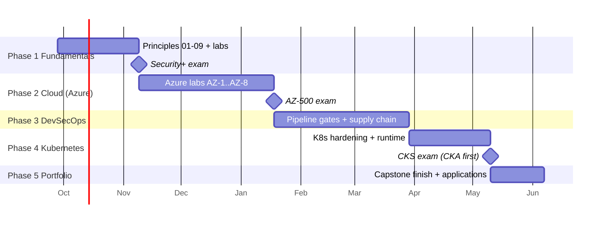

# Roadmap: DevOps/SRE → DevSecOps & Cloud Security Engineer

**Target roles:** DevSecOps Engineer · Cloud Security Engineer · Platform Security Engineer · Security-focused SRE
**Cloud:** Azure ([ADR-0002](../adr/0002-cloud-provider.md)) · **Portfolio:** the hardened GitOps capstone, built in this repo ([ADR-0003](../adr/0003-capstone-in-this-repo.md))
**Pace:** ~8–10 hours a week alongside work → **36 weeks (~8.5 months)**. Faster if you already use Kubernetes and Azure daily.

← Back to the [career study guide](README.md) · Principles: [index](../principles/README.md) · Labs: [status](../labs/README.md) · Capstone: [design](../capstone/README.md)

## Contents
1. [The plan at a glance](#the-plan-at-a-glance)
2. [Phase 1: Security fundamentals (weeks 1–6)](#phase-1-security-fundamentals-weeks-16)
3. [Phase 2: Cloud security on Azure (weeks 7–16)](#phase-2-cloud-security-on-azure-weeks-716)
4. [Phase 3: DevSecOps pipeline security (weeks 17–26)](#phase-3-devsecops-pipeline-security-weeks-1726)
5. [Phase 4: Kubernetes security (weeks 27–32)](#phase-4-kubernetes-security-weeks-2732)
6. [Phase 5: Portfolio and job search (weeks 33–36)](#phase-5-portfolio-and-job-search-weeks-3336)
7. [Positioning yourself](#positioning-yourself)
8. [Progress tracker](#progress-tracker)

---

## The plan at a glance

| Phase | Weeks | Outcome | Certification | Capstone milestone |
|---|---|---|---|---|
| 1 Security fundamentals | 1–6 | Explain and demonstrate principles 01–09 on a real app | **CompTIA Security+** | — |
| 2 Cloud security (Azure) | 7–16 | A secure-by-default AKS environment in Terraform, with identity, network, logging, keys and posture | **AZ-500** | M1: secure cloud foundation |
| 3 DevSecOps pipeline | 17–26 | Every PR scanned; images scanned, SBOM'd and signed; secrets managed | — | M2–M4: gates, supply chain, secrets |
| 4 Kubernetes security | 27–32 | Cluster enforces policy and signatures; runtime detection | **CKA → CKS** | M5–M6: admission, runtime |
| 5 Portfolio + job search | 33–36 | Documented, demo-able capstone; applications out | — | M7: write-up and demo |

**Dates are a guide.** If a phase takes longer, push the rest back rather than skipping labs. The labs are what make you hireable.

---

## Phase 1: Security fundamentals (weeks 1–6)

**Goal:** the security-specific knowledge infrastructure work doesn't teach: OWASP Top 10, attack types (injection, privilege escalation,
lateral movement, supply-chain attacks), STRIDE, and crypto (TLS, certificates, hashing, key management).

| Week | Learn | Hands-on in this repo | Deliverable |
|---|---|---|---|
| 1 | [Baby steps 1–4](../basics/README.md): networking, Linux, web, crypto · [01 CIA & risk](../principles/01-cia-triad-and-risk.md) | ✅ [Lab 0](../labs/lab-00-foundation.md), ✅ [Lab 1](../labs/lab-01-cia-and-risk.md) (done); re-run both yourself | Your notes on the [audit](../../findings/REMEDIATION.md): pick 5 findings and explain each in your own words |
| 2 | [02 Threat modelling](../principles/02-threat-modeling.md) (STRIDE) | Labs 2.1–2.3 | `threat-models/juice-shop.md`: DFD + 15 threats |
| 3 | [05 Attack surface](../principles/05-attack-surface-reduction.md) · [06 Secure defaults](../principles/06-secure-defaults.md) · attack type: **information disclosure** | Labs 5.1–5.2, 6.1–6.2 · [PortSwigger](https://portswigger.net/web-security): *Information disclosure*, *CORS* | Attack-surface inventory table |
| 4 | [07 Never trust input](../principles/07-never-trust-input.md) · attack type: **injection** | Lab 7.1 (SAST triage) · PortSwigger: *SQL injection*, *XSS* | Triage table for 20 Semgrep results |
| 5 | [08 Identity & access](../principles/08-identity-and-access.md) · [baby step 4 again](../basics/04-crypto.md): TLS, certificates · attack types: **privilege escalation**, **access control** | Labs 8.1–8.3 · PortSwigger: *Access control*, *JWT* | Authz review with file:line references |
| 6 | [09 Secrets](../principles/09-protect-data-and-secrets.md) (key management) · [10 Supply chain](../principles/10-supply-chain-integrity.md) (concepts) · [04](../principles/04-defense-in-depth.md) (**lateral movement**) · Security+ revision | Practice exams; [baby step 8 frameworks](../basics/08-frameworks.md) | **Book and pass Security+** (end of week 6–7) |

**Exit criteria:** you can explain each OWASP Top 10 category with a Juice Shop example, threat-model a feature with STRIDE, and explain
TLS, hashing vs encryption, and key rotation without notes.

---

## Phase 2: Cloud security on Azure (weeks 7–16)

**Goal:** go deep on one cloud. All labs use Terraform in [infra/azure/](../../infra/azure/), which is **secure by default** and has a
**budget alert first**. The full lab plan is in [docs/cloud/](../cloud/README.md).

> 💰 **Cost rule:** `make az-plan` is free. `make az-up` costs roughly $0.30–0.50/hour. **Always `make az-down` at the end of a session.**

| Week | Area | Learn | Lab ([cloud labs](../cloud/README.md)) | Deliverable |
|---|---|---|---|---|
| 7 | Identity (1) | Entra ID users, groups, service principals, managed identities; **roles vs users**; MFA and Conditional Access | AZ-1: identity inventory of your subscription | Who has Owner/Contributor, and why |
| 8 | Identity (2) | **Azure RBAC evaluation** (scope inheritance, deny assignments, custom roles); least privilege; PIM concepts | AZ-2: least-privilege custom role for the lab | Custom role JSON + `az role assignment list` evidence |
| 9 | Network | VNets, subnets, **NSGs**, private endpoints, private AKS / API server authorised IP ranges | AZ-3: deploy the secure AKS foundation (`make az-up`), prove the API is IP-restricted | Before/after `kubectl` from an unauthorised IP |
| 10 | Workload identity | OIDC issuer, **AKS workload identity**, federated credentials, no secrets in pods | AZ-4: pod reads a Key Vault secret with no stored credential | Pod log + role assignment evidence |
| 11 | Keys and encryption | **Key Vault** (RBAC mode, purge protection, soft delete), encryption at rest, CMK vs platform keys, rotation | AZ-5: key rotation drill | Rotation runbook |
| 12 | Logging | Activity Log, resource/diagnostic logs, Log Analytics, KQL basics | AZ-6: find "who deleted what" with KQL | Saved KQL queries |
| 13 | Detection | **Defender for Cloud** (CSPM + Defender for Containers), Microsoft Sentinel basics | AZ-7: triage 5 Defender recommendations/alerts | Findings added to the register |
| 14 | Posture | **Azure Policy** for AKS (Pod Security initiative), Checkov on Terraform | AZ-8: policy denies a privileged pod; Checkov baseline for `infra/azure` | Policy compliance screenshot + Checkov report |
| 15–16 | Exam prep | AZ-500 skills outline: identity, networking, compute, data, security operations | Microsoft Learn AZ-500 path + practice assessments | **Pass AZ-500** · **Capstone M1 done** |

**Exit criteria:** the whole cloud environment is created from Terraform with no High Checkov findings; you can explain Azure RBAC
evaluation, workload identity, and where to look when something is deleted.

---

## Phase 3: DevSecOps pipeline security (weeks 17–26)

**Goal:** your strongest area. Build the security gates into CI/CD, and make them useful rather than noisy.
Principles: [07](../principles/07-never-trust-input.md), [09](../principles/09-protect-data-and-secrets.md), [10](../principles/10-supply-chain-integrity.md), [11](../principles/11-shift-left-automation.md).

| Area | Tools (✅ = wired into this repo's pipeline) | Lab | Audit issues it closes |
|---|---|---|---|
| Static code analysis (SAST) | ✅ Semgrep · CodeQL · SonarQube (optional) | 7.1–7.3, C3, C6 | F-016, F-018–F-020 |
| Dependency scanning (SCA) | ✅ Trivy · Dependabot · Snyk (free tier, optional) | 10.2, C5 | F-017, F-024 |
| Container image scanning | ✅ Trivy · Grype | 10.2 | F-017 |
| IaC scanning | ✅ Checkov · ✅ Trivy config (tfsec is now part of Trivy) · KICS (optional) | 11.1 | F-021 + cloud findings |
| Secrets detection | ✅ gitleaks · TruffleHog (verifies whether a found key is live) | 9.1 | F-010, F-013, F-015 |
| Secrets management | SOPS + age (GitOps) · External Secrets Operator + Azure Key Vault · Vault (optional) | 9.2, C2 | F-010, F-013, F-015 |
| Supply chain | Syft (SBOM) · Cosign/Sigstore (signing) · SLSA provenance | 10.1, 10.3 | F-009 |
| Dynamic testing (DAST) | OWASP ZAP (baseline on PR, full nightly) · Burp Suite (manual) | 6.x | F-007, F-008 |
| Vulnerability reporting | ✅ SARIF → GitHub code scanning · DefectDojo · Dependency-Track | — | all (tracking) |

| Week | Focus | Deliverable (capstone) |
|---|---|---|
| 17 | Fork Juice Shop; build your own image in CI from the fork | Image built and pushed to GHCR by GitHub Actions |
| 18 | SAST: Semgrep with a tuned ruleset + one custom rule; CodeQL on the fork | C3: SQL injection fixed; gate blocks template-string SQL |
| 19 | Secrets: gitleaks gate + pre-commit; TruffleHog verification | C2: keys rotated into Kubernetes Secrets; F-010/F-013/F-015 closed |
| 20 | SCA: Trivy + Dependabot; reachability triage; exceptions file with expiry | C5: dependency upgrades; `trivy --ignore-unfixed` gate at 0 |
| 21 | IaC gates (✅ already on `apps/` and `infra/`) + **DAST**: ZAP baseline against an ephemeral kind env in CI | **Capstone M2: PR gates enforced** + DAST report |
| 22 | SBOM with Syft on every build; attach to the image | SBOM published as a build artifact |
| 23 | Cosign keyless signing (GitHub OIDC) + SLSA provenance | **Capstone M3: signed images with provenance** |
| 24 | SOPS + age for GitOps secrets; External Secrets Operator + Key Vault on AKS | **Capstone M4: no plaintext secrets anywhere** |
| 25 | Pipeline security itself: least-privilege tokens, OIDC to Azure, pinned actions, branch protection | Pipeline threat model |
| 26 | Buffer / catch-up · write the Phase 3 blog post | Blog post: "Making security gates developers don't hate" |

**Exit criteria:** a PR that introduces a secret, a vulnerable dependency, SQL built from strings, or a privileged pod **fails CI** with a clear
message, and a clean PR passes in under 10 minutes.

---

## Phase 4: Kubernetes security (weeks 27–32)

**Goal:** the cluster enforces the rules even if CI is bypassed, and notices when something goes wrong at runtime.
Principles: [03](../principles/03-least-privilege.md), [04](../principles/04-defense-in-depth.md), [12](../principles/12-assume-breach.md) · [Stack guide](../architecture/README.md).

| Week | Focus | Labs / plan steps | Deliverable |
|---|---|---|---|
| 27 | RBAC deep dive; service accounts; audit of `can-i` | 3.1, 3.3, **A1** | `trivy config apps/` → 0 failures |
| 28 | Pod Security Standards; securityContext; seccomp | 3.2, 4.2, **A3** | Namespace enforces `restricted` |
| 29 | NetworkPolicy (kind + Azure CNI Cilium on AKS) | 4.1, **A2** | Default-deny with evidence |
| 30 | Admission control: **Kyverno** (verify signatures, trusted registries, required labels); OPA Gatekeeper comparison | 10.3, **A4** | **Capstone M5: unsigned image rejected** |
| 31 | Runtime: **Falco** rules, audit logging, triage runbooks | 12.1–12.2 | **Capstone M6: Falco alert → runbook** |
| 32 | Incident game day on the full stack; CKS practice (killer.sh) | 12.3 | Incident report · **book CKS** |

**Certification note:** CKS requires an active **CKA**. If you don't have it, take CKA during Phase 3 (your Kubernetes background makes it a
2–3 week effort), then CKS at the end of Phase 4.

---

## Phase 5: Portfolio and job search (weeks 33–36)

| Week | Focus | Deliverable |
|---|---|---|
| 33 | Finish the capstone write-up: architecture diagram, a decision record for each security control, a demo script | **Capstone M7** ([design](../capstone/README.md)) |
| 34 | Record a 5-minute demo: bad PR blocked → fixed → signed → admitted → Falco alert on a shell | Demo video linked from the README |
| 35 | Résumé, LinkedIn and GitHub profile ([positioning](#positioning-yourself)); mock interviews from the [question bank](README.md#interview-preparation) | Updated résumé; 2 mock interviews |
| 36 | Applications (external) and conversations (internal move) | 10+ targeted applications |

---

## Positioning yourself

**You're not starting from zero.** You've built production-style infrastructure. Describe it in security terms, with evidence:

| What you did (SRE/DevOps) | How to describe it (security) | Evidence |
|---|---|---|
| Built CI/CD pipelines | "Built CI/CD pipelines **with automated security gates** (SAST, SCA, secrets, IaC, image scanning)" | This repo's [security workflow](../../.github/workflows/security.yml) |
| Ran Argo CD / GitOps | "Implemented GitOps with **drift detection as a security control** and signed-image admission" | SRE lab Phase 7 + capstone M5 |
| Terraform on AKS with a budget alert | "Wrote **secure-by-default** cloud infrastructure: workload identity, Key Vault, Azure Policy, private API access" | [infra/azure/](../../infra/azure/) + Checkov report |
| Incident game days, postmortems | "Ran **incident response** drills using a structured lifecycle and blameless postmortems" | SRE lab Phase 4 + Lab 12.3 |
| Audited a service | "Performed a **security audit**: 179 scanner results triaged to 24 issues with a prioritised remediation plan" | [REMEDIATION.md](../../findings/REMEDIATION.md) |

**Titles to search for:** DevSecOps Engineer · Cloud Security Engineer · Platform Security Engineer · Security-focused SRE · Product Security
Engineer (infrastructure).

**Internal move (often the fastest route).** Volunteer for security work where you are now:
- Own the fix-up of scanner findings for one team or service
- Lead an IAM or RBAC clean-up (least-privilege review)
- Drive a secrets migration (hard-coded or CI secrets → Key Vault/Vault + rotation)
- Add one security gate to an existing pipeline, with a baseline so it doesn't block everyone
- Join incident reviews when a security issue comes up

Each of these gives you a real story for interviews, and a reference from the security team.

---

## Progress tracker

**Phase 1**
- [x] Week 1: Lab 0 and Lab 1 (done 2026-09-26, with a 24-issue audit)
- [ ] Week 2 · [ ] Week 3 · [ ] Week 4 · [ ] Week 5 · [ ] Week 6 · [ ] **Security+ passed**

**Phase 2**
- [ ] AZ-1 · [ ] AZ-2 · [ ] AZ-3 · [ ] AZ-4 · [ ] AZ-5 · [ ] AZ-6 · [ ] AZ-7 · [ ] AZ-8 · [ ] **AZ-500 passed** · [ ] **M1**

**Phase 3**
- [ ] Fork + build · [ ] SAST · [ ] Secrets · [ ] SCA · [ ] **M2** · [ ] SBOM · [ ] **M3** · [ ] **M4** · [ ] Pipeline threat model · [ ] Blog post

**Phase 4**
- [ ] A1 · [ ] A3 · [ ] A2 · [ ] **M5** · [ ] **M6** · [ ] Game day · [ ] **CKA** · [ ] **CKS**

**Phase 5**
- [ ] **M7** · [ ] Demo video · [ ] Résumé · [ ] Mock interviews ×2 · [ ] Applications sent
