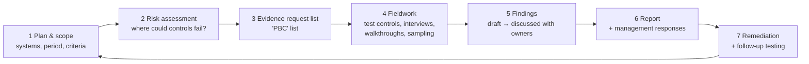

# Governance, Risk and Compliance (GRC)

Engineering controls (the rest of this repo) prove *to yourself* that systems are secure. GRC is how an organisation **decides** what
"secure enough" means, **proves** it to auditors, customers and regulators, and **keeps** proving it. Every security engineer meets
GRC: audit evidence requests, customer security questionnaires, and controls that exist because a standard requires them.

> **Currency note:** standards and laws change. Versions and dates here were checked as of September 2026. Always confirm against the
> official source before relying on a detail at work.

## Pages

| Page | What's in it |
|---|---|
| **This page** | Audits: types, when they happen, how they're run, evidence, and how this repo produces evidence |
| [Standards and regulations](standards-and-regulations.md) | ISO 27001 family, SOC 2, NIST, FedRAMP, CMMC, HIPAA, SOX, GDPR, NIS2, DORA, EU AI Act, and more |
| [Privacy and PII protection](privacy-and-pii.md) | What PII is, privacy principles, GDPR/CCPA rights, DPIAs, breach notification, technical controls |
| [Payments, ATM and EDI security](payments-atm-edi.md) | PCI DSS v4, cardholder data, tokenization, PIN security, ATMs, HSMs, ISO 8583, EDI (AS2, X12, EDIFACT), SWIFT |
| [Security awareness and phishing simulations](security-awareness-phishing-simulation.md) | How in-house phishing tests are run, tracked and measured |

---

## 1. Key terms

| Term | Meaning |
|---|---|
| **Governance** | Who decides: policies, roles, risk appetite, oversight by leadership |
| **Risk management** | Identify, assess, treat (mitigate, transfer, avoid, accept) and monitor risks ([Principle 01](../principles/01-cia-triad-and-risk.md)) |
| **Compliance** | Meeting external requirements (laws, standards, contracts) and being able to **prove** it |
| **Framework / standard / regulation** | Guidance you choose (NIST CSF) / a specification you can be certified or attested against (ISO 27001, PCI DSS) / law you must follow (GDPR, HIPAA) |
| **Control** | A safeguard: preventive, detective or corrective; administrative, technical or physical |
| **Control owner** | The person accountable for a control working |
| **Evidence** | Proof a control exists and operated: configs, logs, tickets, screenshots, reports |
| **Finding / non-conformity** | An auditor's statement that a control is missing or didn't work (ISO grades them *major* or *minor*) |
| **Compensating control** | An alternative control that meets the intent when the standard one isn't possible (see EXC-001 in [SECURITY-EXCEPTIONS.md](../../SECURITY-EXCEPTIONS.md)) |
| **Statement of Applicability (SoA)** | ISO 27001 document listing which Annex A controls apply, and why any don't |
| **Scope** | Which systems, locations, teams and data the audit covers. Smaller scope = cheaper, easier compliance |
| **Three lines model** | 1st line: teams owning risk and controls · 2nd line: security/risk/compliance functions that set policy and oversee · 3rd line: internal audit, independent assurance |

---

## 2. Types of audits and assessments

| Type | Who does it | When | Output | Example |
|---|---|---|---|---|
| **Internal audit** | The company's own audit team (independent of the area audited) | Yearly plan; before external audits | Internal report + action plan | ISO 27001 clause 9.2 *requires* internal audits |
| **External certification audit** | Accredited certification body | Initial: Stage 1 (documents) + Stage 2 (implementation); then yearly surveillance; recertification every 3 years | Certificate | ISO 27001 |
| **Attestation examination** | Licensed CPA firm | Yearly (Type II covers a 3–12 month period) | Attestation report for customers under NDA | SOC 2 |
| **Assessment against a baseline** | Accredited third-party assessor | Initial authorisation + continuous monitoring + annual assessment | Security package / authorisation | FedRAMP (3PAO), PCI DSS (QSA) |
| **Self-assessment** | The company itself | Yearly | Self-Assessment Questionnaire / attestation | PCI DSS SAQ for smaller merchants |
| **Regulatory examination** | A regulator | Periodic or triggered by an incident | Findings, possible penalties | Banking supervisors, data-protection authorities |
| **Customer audit / questionnaire** | Your customers | During sales and at renewal | Answers + evidence (or your SOC 2 / ISO certificate) | SIG, CAIQ questionnaires |
| **Penetration test** | Internal red team or external firm | Yearly and after major changes; required by PCI DSS 11.4 | Report with findings | External + internal network and application tests |
| **Vulnerability scanning** | Internal team; ASV for PCI external scans | Continuous / at least quarterly | Scan reports | This repo's weekly `security.yml` |

---

## 3. How an audit is run

**How auditors test a control:**

| Method | Example |
|---|---|
| **Inquiry** | "How do you approve access to production?" (never enough on its own) |
| **Observation** | Watching an engineer request and receive access |
| **Inspection** | Reading the access-request tickets, the RBAC config, the CI logs |
| **Re-performance** | The auditor re-runs the check: e.g. `trivy config apps/` and compares the result with the report |
| **Sampling** | For recurring controls, test a sample (e.g. 25 of 400 production changes) to check each had review + passing CI |

**Design vs operating effectiveness:** a control can be *designed* well (the policy says PRs need review) but not *operate* (half the
merges bypassed review). SOC 2 **Type I** tests design at a point in time; **Type II** tests operation over a period, which is what customers usually want.

**Typical evidence requests for an engineering team:**
- Access reviews: who has admin, who approved it, quarterly review records
- Change management: PR reviews, required CI checks, branch protection settings
- Vulnerability management: scan results, SLA adherence, exceptions with approvals
- Logging and monitoring: what's logged, retention, alert handling
- Incident response: plan, tabletop exercise records, incident tickets and postmortems
- Encryption: at-rest and in-transit configuration, key management
- Backups: schedule **and restore tests**
- Security awareness training completion

---

## 4. A typical yearly compliance calendar

| When | Activity |
|---|---|
| Continuous | Vulnerability scanning, log monitoring, automated control checks ("continuous compliance") |
| Monthly | Patch compliance, exception reviews, security metrics to leadership |
| Quarterly | Access reviews, PCI ASV external scans, risk register review |
| Twice a year | Phishing simulations, tabletop incident exercise |
| Yearly | Risk assessment, policy review, penetration tests, awareness training, internal audit, external audit / surveillance audit, BCP/DR test |
| Every 3 years | ISO 27001 recertification |
| On change | Threat model and security review for major changes; re-test after major infrastructure changes |

**Continuous compliance tools** automate evidence collection: Vanta, Drata, Secureframe, and cloud-native dashboards (Microsoft Defender
for Cloud *Regulatory compliance* view, AWS Audit Manager). They map automated checks to controls in several frameworks at once.

---

## 5. This repo as audit evidence

Much of what the lab builds is exactly what auditors ask for. The mapping below is illustrative (control numbers from ISO 27001:2022
Annex A, the SOC 2 Common Criteria and PCI DSS v4.0):

| Evidence in this repo | ISO 27001:2022 | SOC 2 | PCI DSS v4 |
|---|---|---|---|
| Blocking CI security gates ([security.yml](../../.github/workflows/security.yml)) | 8.25 secure development life cycle, 8.29 security testing | CC8.1 change management | 6.2, 6.3 |
| Weekly vulnerability scans + SARIF reporting | 8.8 management of technical vulnerabilities | CC7.1 | 11.3, 6.3.3 |
| Finding register with risk ratings ([findings/](../../findings/README.md)) | 5.7 threat intelligence, 8.8 | CC3.2 risk assessment | 6.3.1, 12.3.1 |
| Exceptions with owner + expiry ([SECURITY-EXCEPTIONS.md](../../SECURITY-EXCEPTIONS.md)) | 6.1.3 risk treatment (clause) | CC3.4, CC9.1 | 12.3.1, compensating controls (Appendix B) |
| Secrets scanning + rotation plan | 8.24 use of cryptography, 5.17 authentication information | CC6.1 | 3.6, 8.3 |
| Least-privilege RBAC, workload identity, no local admin (Terraform) | 5.15 access control, 8.2 privileged access | CC6.1–CC6.3 | 7.2, 8.2 |
| NetworkPolicy, default-deny, IP allow-lists | 8.20 networks security, 8.22 segregation of networks | CC6.6 | 1.2–1.4 |
| Pinned + signed supply chain, SBOM (planned) | 5.21 ICT supply chain, 8.28 secure coding | CC9.2 | 6.3.2 (inventory of custom and third-party software) |
| Audit logging, Falco (planned) | 8.15 logging, 8.16 monitoring activities | CC7.2 | 10.2, 10.4 |
| Incident template + game day | 5.24–5.27 incident management | CC7.3–CC7.5 | 12.10 |
| Phishing simulations / training | 6.3 awareness, education and training | CC1.4, CC2.2 | 12.6 |
| Git history of every change with review | 8.32 change management | CC8.1 | 6.5.1 |

**Interview line:** "Compliance is a *by-product* of good engineering when controls are automated and leave evidence. My pipeline's
CI logs, scan reports and exception register answer most change-management and vulnerability-management audit requests without
anyone taking screenshots."

---

## Interview questions
1. What's the difference between an ISO 27001 certification and a SOC 2 Type II report?
2. Walk me through how an auditor would test your change-management control.
3. What is a compensating control? Give an example.
4. How would you reduce the effort of preparing for a yearly audit?
5. Design vs operating effectiveness: explain with an example.
6. What evidence would you provide to show vulnerabilities are managed?
