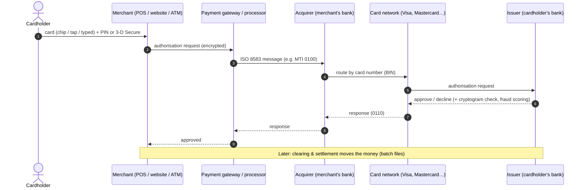
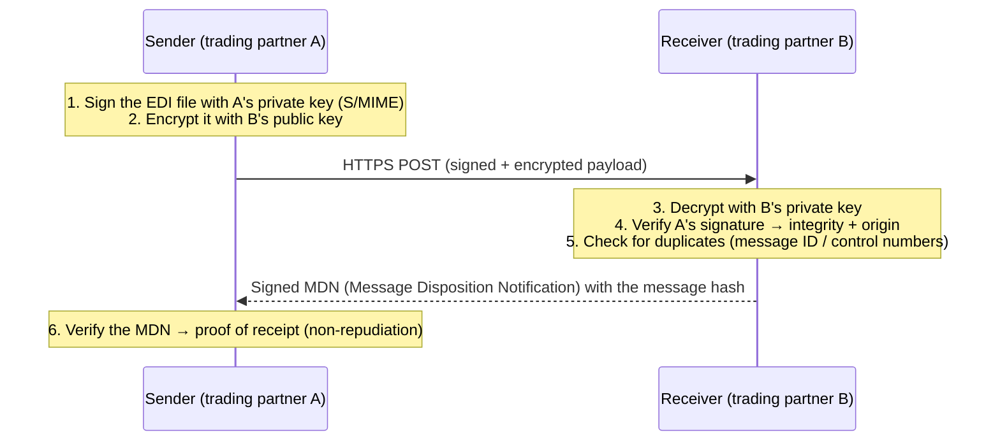

# Payments, ATM and EDI Security

Card payments, PIN and ATM security, payment cryptography, and business-to-business data exchange (EDI), with all the key concepts and
the standards behind them. ← [GRC index](README.md)

> Checked as of September 2026. PCI standards are updated regularly; always confirm details at pcisecuritystandards.org.

## Contents
1. [How a card payment works](#1-how-a-card-payment-works)
2. [PCI DSS v4: the core concepts](#2-pci-dss-v4-the-core-concepts)
3. [Reducing PCI scope](#3-reducing-pci-scope)
4. [The wider PCI family](#4-the-wider-pci-family)
5. [Card and payment security technologies (EMV, 3-D Secure, tokenisation)](#5-card-and-payment-security-technologies)
6. [Payment cryptography: HSMs, keys, PIN blocks, DUKPT](#6-payment-cryptography-hsms-keys-pin-blocks-dukpt)
7. [ATM security](#7-atm-security)
8. [Electronic Data Interchange (EDI) security](#8-electronic-data-interchange-edi-security)
9. [Bank messaging: SWIFT, ISO 20022, host-to-host](#9-bank-messaging-swift-iso-20022-host-to-host)
10. [Real incidents and the lesson in each](#10-real-incidents-and-the-lesson-in-each)
11. [Interview questions](#11-interview-questions)

---

## 1. How a card payment works

- **Authorisation** (real time): "Is this card valid, and are there funds?" **Clearing and settlement** (batch): the money actually moves.
- **ISO 8583** is the message format card systems use between terminals, processors, acquirers, networks and issuers (a message type indicator such as `0100`/`0110`, plus numbered data fields).
- **Card-present** (chip, contactless, magnetic stripe) vs **card-not-present** (online, phone). Fraud has shifted to card-not-present as chip cards made counterfeiting harder.

---

## 2. PCI DSS v4: the core concepts

**PCI DSS** (Payment Card Industry Data Security Standard) is set by the PCI Security Standards Council (founded by the card brands). It
applies to **every entity that stores, processes or transmits cardholder data**, and to anything that can affect its security.
Compliance is enforced through contracts with the card brands and acquirers, not by law. The current version is **v4.0.1** (June 2024);
the future-dated v4 requirements became mandatory on **31 March 2025**.

### Account data: what you may and may not keep

| Data element | Category | Store after authorisation? | If stored |
|---|---|---|---|
| **PAN** (Primary Account Number: the card number) | Cardholder data | Allowed only if needed | Must be **unreadable**: strong encryption, truncation, tokenisation or keyed hashing (req. 3.5) |
| Cardholder name, expiry date, service code | Cardholder data | Allowed if needed | Protect |
| **Full track / chip data** | Sensitive Authentication Data (**SAD**) | ❌ **Never** (even encrypted) | — |
| **CVV2 / CVC2 / CID** (the 3–4 digits) | SAD | ❌ **Never** | — |
| **PIN / PIN block** | SAD | ❌ **Never** | — |

Displays must be masked: show at most the first 6 / last 4 digits (BIN + last four) unless there's a business need to see more.

### The 12 requirements (in 6 goals)

| Goal | # | Requirement | Engineering examples |
|---|---|---|---|
| Build and maintain a secure network and systems | 1 | Install and maintain **network security controls** | Firewalls, security groups, NetworkPolicy; the **CDE** (cardholder data environment) segmented |
| | 2 | Apply **secure configurations** to all system components | No default passwords, hardening (CIS), unused services off |
| Protect account data | 3 | **Protect stored account data** | Don't store SAD; encrypt/tokenise PAN; key management; data retention |
| | 4 | Protect cardholder data with **strong cryptography during transmission** over open, public networks | TLS 1.2+, certificate inventory |
| Maintain a vulnerability management programme | 5 | Protect systems from **malicious software** | Anti-malware / EDR, anti-phishing |
| | 6 | Develop and maintain **secure systems and software** | Secure SDLC, code review, patching (critical within 1 month), WAF for public apps, **inventory and integrity of payment-page scripts (6.4.3)** |
| Implement strong access control | 7 | Restrict access by **business need to know** | RBAC, least privilege, access reviews |
| | 8 | **Identify users and authenticate** access | Unique IDs, **MFA for all access into the CDE** (8.4.2), password rules, no shared accounts, service-account management |
| | 9 | Restrict **physical access** | Data centres, POS device inspection for tampering |
| Regularly monitor and test networks | 10 | **Log and monitor** all access | Audit logs for CDE, time sync, automated log review, 12-month retention (3 months immediately available) |
| | 11 | **Test security** regularly | Internal + **ASV external scans quarterly**, penetration tests yearly + after significant changes, segmentation tests, IDS/IPS, **change/tamper detection on payment pages (11.6.1)** |
| Maintain an information security policy | 12 | Support security with **policies and programmes** | Risk analysis, awareness training (12.6), third-party service provider management, **incident response plan (12.10)** |

### Validation: how compliance is proven

| Entity | Level (Visa's definitions, roughly followed by others) | Validation |
|---|---|---|
| Merchant **Level 1** | > 6 million transactions/year (or after a breach) | Annual **ROC** (Report on Compliance) by a **QSA** (or internal ISA) + **AOC** (Attestation of Compliance); quarterly ASV scans |
| Merchant Levels 2–4 | 1–6 million / 20,000–1 million e-commerce / smaller | Usually a **SAQ** (Self-Assessment Questionnaire) + AOC + ASV scans (acquirer decides) |
| Service provider Level 1 | > 300,000 transactions/year | ROC by a QSA |

**SAQ types** depend on how you take payments. For example, **SAQ A** is for e-commerce merchants that fully outsource the payment page (redirect
or iframe). **SAQ A-EP** applies if your site affects the payment page. **SAQ D** is the full set.

**New in v4:** a **customised approach**: meet a requirement's objective your own way, with a targeted risk analysis, instead of the defined
approach. **Targeted risk analyses** set frequencies for some controls.

---

## 3. Reducing PCI scope

The cheapest PCI control is **not having card data**. Everything that stores, processes or transmits it, *or is connected to those systems*, is in scope.

| Technique | How it reduces scope |
|---|---|
| **Outsource the payment page** (hosted fields, iframe, redirect to the PSP) | Card data never touches your servers: SAQ A |
| **Tokenisation** | Your systems store a token; the real PAN lives with the tokenisation provider |
| **P2PE** (point-to-point encryption, validated) | Card data encrypted inside the payment terminal; you can't decrypt it |
| **Network segmentation** | Isolate the CDE so other systems are out of scope, and **prove it with segmentation tests** |
| **Data retention** | Delete what you don't need; find stray PANs with data-discovery scans |

**This lab's link:** the Juice Shop stores full card numbers in its own database (asset A3 in the
[asset inventory](../../threat-models/juice-shop-assets.md)). In a real shop that would put the whole app, database, cluster and pipeline in PCI scope.
The fix would be a PSP's hosted payment fields plus tokens.

---

## 4. The wider PCI family

| Standard | Covers |
|---|---|
| **PCI PTS POI** | Security of payment terminals and PIN entry devices (tamper resistance) |
| **PCI PIN Security Requirements** | Secure handling of PINs and PIN-encryption keys by acquirers and processors |
| **PCI P2PE** | Validated point-to-point encryption solutions |
| **PCI 3DS Core Security Standard** | Environments running 3-D Secure components |
| **PCI Secure Software Standard + Secure SLC** | Payment software and the vendor's development life cycle (replaced PA-DSS, retired in 2022) |
| **PCI MPoC** (and earlier SPoC/CPoC) | Accepting payments on commercial phones and tablets ("tap to phone") |
| **PCI Card Production** | Card manufacturing and personalisation |
| **PCI HSM** | Hardware security modules used in payments |

---

## 5. Card and payment security technologies

| Technology | What it does | Protects against |
|---|---|---|
| **EMV chip** (Europay, Mastercard, Visa) | The chip creates a **unique cryptogram** (ARQC) for each transaction, which the issuer verifies | Counterfeit cards made from copied magnetic-stripe data |
| **Contactless (EMV)** | Same cryptogram model over NFC; limits per transaction | Same |
| **Magnetic stripe** | Static data, easily copied | Nothing: the reason skimming works. Being phased out |
| **3-D Secure 2** (Visa Secure, Mastercard Identity Check) | Issuer authenticates the online shopper (risk-based, often frictionless) | Card-not-present fraud; shifts liability |
| **Network tokenisation** | Card networks replace the PAN with a token restricted to one merchant or device | Stolen stored card numbers become useless elsewhere |
| **Mobile wallets** (Apple Pay, Google Pay) | Device-specific token + biometric + per-transaction cryptogram | Card number never shared with the merchant |
| **Fraud scoring / velocity rules** | Machine learning on transaction patterns | Account takeover, card testing |

---

## 6. Payment cryptography: HSMs, keys, PIN blocks, DUKPT

| Concept | Meaning |
|---|---|
| **HSM** (Hardware Security Module) | Tamper-resistant hardware that stores keys and performs cryptography so keys never exist in clear outside it. Payment HSMs are certified to **PCI HSM** and/or **FIPS 140-3** (typically Level 3). Used for PIN translation, card verification, key generation |
| **Key hierarchy** | Master keys protect key-encrypting keys, which protect working keys (e.g. zone master key between two banks → PIN encryption keys) |
| **Split knowledge and dual control** | No single person ever knows or controls a whole key. Key components are held by different **key custodians**, used together in a witnessed **key ceremony** |
| **PIN block** (ISO 9564) | The PIN is formatted with parts of the card number and encrypted, so it's never sent in clear. ISO format 4 is the AES-based format |
| **DUKPT** (Derived Unique Key Per Transaction, ANSI X9.24) | Each terminal derives a **new key for every transaction** from a base key. Compromising one transaction's key doesn't expose others. **AES DUKPT** replaces the older TDES version |
| **TR-31 key blocks** (ANSI X9.143) | Keys are exchanged wrapped together with their **usage attributes**, so a PIN key can't be misused as a data key |
| **TR-34** | Remote key loading to terminals using asymmetric cryptography, instead of physically injecting keys |
| **TDES → AES migration** | Payment networks are moving from Triple-DES to AES, on timelines set by PCI PIN and the card brands |
| **Cloud payment HSMs** | Cloud providers now offer payment HSMs (e.g. AWS Payment Cryptography, Azure Payment HSM) |

---

## 7. ATM security

### How an ATM works
An ATM is a PC (often Windows-based) inside a safe, with peripherals: card reader, **encrypting PIN pad (EPP)**, cash dispenser, receipt
printer. The peripherals are driven through **CEN/XFS** middleware. The ATM talks to the bank's **host** (ATM switch) using protocols such as
**NDC/DDC**, carried over TLS or VPN, and the host joins the card-network flow above.

### Threats

| Category | Attack | How it works |
|---|---|---|
| **Card data theft** | **Skimming** | Overlays, deep-insert skimmers or **shimmers** (on the chip reader) copy card data; hidden cameras or PIN-pad overlays capture the PIN |
| | Card trapping | A device keeps the card; the attacker retrieves it after watching the PIN |
| **Cash theft (logical)** | **Jackpotting (malware)** | Malware on the ATM PC sends dispense commands through XFS |
| | **Black-box attack** | Attacker opens the top box and connects their own device directly to the cash dispenser |
| | Network attacks | Man-in-the-middle between the ATM and the host to fake approvals |
| **Cash theft (physical)** | Cash trapping, explosive or ram-raid attacks | Physical |
| **Fraud** | Transaction reversal fraud | Manipulating the dispense/reversal process |

### Controls

| Layer | Controls |
|---|---|
| Card + PIN | **EMV** chip transactions; **anti-skimming** devices (jammers, detection) on the card reader; **PCI PTS-approved EPP**; privacy shields; magnetic-stripe fallback disabled or limited |
| Cash dispenser | **Encrypted and authenticated communication** between the PC and the dispenser (defeats black-box attacks); physical authentication for maintenance |
| ATM PC (it's a Windows endpoint) | Hardened OS, **application allow-listing**, **full-disk encryption**, BIOS/UEFI password + **secure boot** + disabled external boot, USB port control, patching, EDR built for ATMs |
| Network | TLS/VPN to the host, mutual authentication, **network segmentation**, no inbound access, monitoring |
| Monitoring | XFS event logs, the **electronic journal**, alerts on unusual dispense patterns, door and vibration sensors, remote monitoring |
| Physical | Anchoring, alarms, CCTV, dye-staining of notes, anti-explosive measures, secure servicing procedures |

Guidance: PCI's *ATM Security Guidelines* information supplement, and ATM Industry Association (ATMIA) and EAST (European Association for
Secure Transactions) best practices and alerts.

---

## 8. Electronic Data Interchange (EDI) security

**EDI** is the structured, automated exchange of business documents (orders, invoices, shipping notices, claims, payments) between companies'
systems, in standard formats, without people re-keying them.

### Standards and transports

| | Examples |
|---|---|
| **Message standards** | **ANSI X12** (North America; e.g. 850 purchase order, 810 invoice, 856 ship notice; HIPAA healthcare: **837** claim, **835** payment/remittance, **270/271** eligibility) · **UN/EDIFACT** (international; ORDERS, INVOIC) · EANCOM/GS1 (retail) · HL7 (healthcare data) · **Peppol** (EU e-invoicing network) |
| **Transport protocols** | **AS2** (over HTTP/S) · **AS4** (web-services based; used by Peppol and EU energy) · **SFTP**, FTPS · **OFTP2** (European automotive) · **VAN** (Value-Added Network, a managed mailbox provider) · increasingly APIs |

### AS2: how it secures a message

| Security property | EDI mechanism |
|---|---|
| **Confidentiality** | Payload encryption (S/MIME in AS2, PGP for files over SFTP) **plus** TLS |
| **Integrity + origin** | Digital signatures on the payload |
| **Non-repudiation** | **Signed MDN receipts**: neither side can later deny sending or receiving; important in disputes |
| **Authentication** | Partner certificates, SSH keys, mutual TLS; per-partner credentials |
| **Replay/duplicate protection** | Message IDs; X12 interchange and group control numbers checked for duplicates |
| **Audit trail** | Logs of every message, MDN, and failure, retained for disputes and audits |

### EDI security risks and controls

| Risk | Control |
|---|---|
| **Certificate expiry** takes a trading partnership offline (a very common outage) | Certificate inventory with expiry alerts; planned rollover with partners |
| Weak or shared credentials for SFTP/VAN mailboxes | Key-based auth, per-partner accounts, IP allow-lists, MFA for admin portals |
| **Malicious or malformed EDI content**: parsers are complex and process untrusted input ([Principle 07](../principles/07-never-trust-input.md)) | Strict schema validation, size limits, run translators with least privilege, patch EDI software |
| **Business email compromise + bank-detail changes** in remittance or vendor-master updates | Out-of-band verification of payment-detail changes (also [Principle 13](../principles/13-ai-era-security.md) deepfakes) |
| Third-party risk (VAN, EDI provider, integration platform) | Vendor assessments (SOC 2 reports), contracts, monitoring |
| Sensitive data in transit and at rest (claims = PHI; invoices = commercial) | Encryption, retention limits, access control; HIPAA for healthcare EDI |
| Unencrypted legacy transports (plain FTP) | Migrate to AS2/SFTP/AS4; block plain FTP at the firewall |

---

## 9. Bank messaging: SWIFT, ISO 20022, host-to-host

| Topic | Key points |
|---|---|
| **SWIFT** | The global network banks use to exchange payment instructions |
| **SWIFT Customer Security Programme (CSP)** | Every SWIFT user must follow the **Customer Security Controls Framework (CSCF)** (mandatory + advisory controls: secure the local SWIFT environment, restrict internet access, segregate critical systems, protect credentials, detect anomalies, plan for incidents) and submit a yearly **attestation**, supported by an independent assessment |
| **ISO 20022** | The rich, structured XML message standard replacing older formats (e.g. SWIFT MT) for payments. Cross-border SWIFT payments moved to ISO 20022 (the coexistence period ended in November 2025). Better data also helps fraud and sanctions screening |
| **Host-to-host (H2H)** | Corporate systems sending payment files (e.g. ISO 20022 `pain.001`, US **NACHA/ACH** files) directly to banks, usually SFTP + PGP signing/encryption + IP allow-lists |
| **Payment-file integrity** | Files are sign-and-verify end to end, so nobody can edit beneficiary details between ERP and bank. Dual approval for releases |

---

## 10. Real incidents and the lesson in each

| Incident | What happened | Lesson / controls |
|---|---|---|
| **Target (2013)** | Stolen vendor credentials → network → **RAM-scraping malware on POS terminals**; ~40M cards | Segmentation (PCI req. 1), P2PE so card data is never in clear in POS memory, act on alerts |
| **Bangladesh Bank (2016)** | Attackers with access to the bank's SWIFT environment sent fraudulent payment instructions; **~US$81M** stolen | Secure the local SWIFT environment; this incident led directly to the SWIFT CSP |
| **ATM jackpotting (US alerts, 2018 onward)** | Attackers posing as technicians installed malware or black boxes on standalone ATMs | Dispenser encryption, allow-listing, disk encryption, physical servicing controls |
| **British Airways / Magecart (2018)** | Malicious JavaScript injected into the payment page sent card data to an attacker's server ("e-skimming") | Why PCI DSS v4 added **6.4.3** (inventory + integrity of payment-page scripts) and **11.6.1** (detect unauthorised changes); CSP headers ([Principle 06](../principles/06-secure-defaults.md)) |

---

## 11. Interview questions
1. What data may never be stored after authorisation under PCI DSS, even encrypted?
2. How would you reduce PCI scope for a new e-commerce site?
3. What do PCI DSS 6.4.3 and 11.6.1 protect against, and how would you implement them?
4. Explain DUKPT and why a unique key per transaction matters.
5. What's split knowledge and dual control, and where is it used?
6. How does an EMV chip stop counterfeit cards, and why has fraud moved online?
7. Describe a black-box ATM attack and the control that defeats it.
8. How does AS2 provide non-repudiation?
9. What are the most common security and operational risks in EDI integrations?
10. What was the SWIFT Customer Security Programme a response to, and what does it require?
