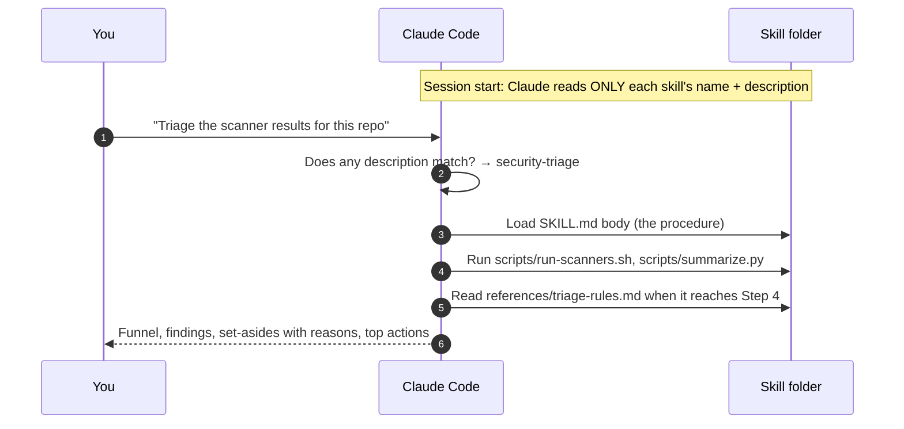

# Building Claude Skills: A Reference Guide

How Claude Code skills work, how the first one in this repo (**security-triage**) was built and tested, how to use it, and a repeatable
process plus template for building the next ones.

← [INDEX](../../INDEX.md) · The skill itself: [.claude/skills/security-triage/](../../.claude/skills/security-triage/SKILL.md) ·
Template: [skill-template.md](skill-template.md)

## Contents
1. [What a skill is](#1-what-a-skill-is)
2. [How Claude loads and uses a skill](#2-how-claude-loads-and-uses-a-skill)
3. [Where skills live](#3-where-skills-live)
4. [Anatomy of a skill](#4-anatomy-of-a-skill)
5. [Case study: how security-triage was built](#5-case-study-how-security-triage-was-built)
6. [Using security-triage](#6-using-security-triage)
7. [Testing a skill](#7-testing-a-skill)
8. [Process for your next skill](#8-process-for-your-next-skill)
9. [Pitfalls](#9-pitfalls)
10. [Skill backlog for this repo](#10-skill-backlog-for-this-repo)

---

## 1. What a skill is

A **skill** is a packaged procedure that Claude loads when a task matches it. It's a folder with a `SKILL.md` file (instructions) and
optionally `scripts/` (code Claude runs) and `references/` (material Claude reads only when needed).

A skill isn't a knowledge dump. Claude already knows what STRIDE or SAST is. A skill adds what Claude **can't** know on its own:
- **your procedure**: the steps, in order, and what "done" looks like
- **your judgement**: the rules and gotchas you learned the hard way (for example "a private key is never set aside because of its path")
- **your tooling**: scripts that make the deterministic parts repeatable

## 2. How Claude loads and uses a skill



This is **progressive disclosure**:
- Only the description costs context all the time.
- The body loads when the skill is triggered.
- References load only at the step that needs them.

That's why the description must be precise, and why long material belongs in `references/`.

**Discovery takes a moment.** Claude Code watches the skills folders. Tested here: invoking `security-triage` right after creating the
folder returned "Unknown skill", and a few minutes later the skill appeared in the session's skill list and loaded correctly. If a new
skill doesn't show up, wait briefly or start a new session in that directory.

## 3. Where skills live

| Location | Scope | Use for |
|---|---|---|
| `<repo>/.claude/skills/<name>/` | Anyone working in this repo (it's committed) | Skills tied to this repo's scripts and conventions, like security-triage |
| `~/.claude/skills/<name>/` | You, in every project | Personal, general-purpose skills |
| A **plugin** | Anyone who installs it | Sharing a set of skills with a team or publicly |

Your `~/.claude/skills/` already contains single-file skills (`security-audit.md`, `secret-mgmt.md`…). The **folder format** used here is
what lets a skill bundle scripts and references.

## 4. Anatomy of a skill

```
.claude/skills/security-triage/
├── SKILL.md                    # required: frontmatter + procedure (keep it short)
├── scripts/
│   ├── run-scanners.sh         # deterministic: check tools, run scanners, save JSON
│   └── summarize.py            # deterministic: normalise, tag, group, write summary.md
└── references/
    ├── triage-rules.md         # judgement: rules R1–R10 + ground-truth worked examples + tool gotchas
    └── finding-format.md       # output contract
```

### SKILL.md frontmatter

```yaml
---
name: security-triage          # lowercase-hyphen, matches the folder name, ≤ 64 chars
description: <what it does>. Use when <triggers>. Not for <near misses> (use <other skill>).
---
```

The **description is the trigger**. A good one has three parts:
1. **What it does**, concretely, naming the tools and inputs.
2. **When to use it**: the phrases a user would actually say ("scan a repo", "triage scanner output", "cut false positives").
3. **When not to**: near-misses and which skill to use instead. This stops two skills competing (here: `security-audit` for manual review).

### SKILL.md body
Write it as numbered steps, not an essay. Each step should say the command or check, the decision to make, and what goes forward.
Guardrails come first. The output contract comes last.

## 5. Case study: how security-triage was built

**Step 1: Pick one job.** Not "security", but *running scanners and triaging the output*. That's the job you repeat most, it builds on
verified work in this repo ([REMEDIATION.md §3](../../findings/REMEDIATION.md#3-scanner-results-and-triage)), and it has a ground truth to test against.

**Step 2: Check for overlap.** `~/.claude/skills/security-audit.md` already covers manual code review. So security-triage is scoped to
*scanner-driven* triage, and its description points to security-audit for the other case.

**Step 3: Harvest the judgement from the labs.** The rules in [triage-rules.md](../../.claude/skills/security-triage/references/triage-rules.md)
each came from a real decision:

| Rule | From |
|---|---|
| In scope = deployed/served + reachable + no neutralising control | The audit's core triage rule |
| Read the code before deciding | The open redirect: Lab 3 read the wrong helper and wrongly dismissed it; the skill's re-run caught it |
| Keep alarms that point at a missing assertion | Trivy "runs as root" on a non-root image (Lab 4) |
| Rate chains | Password in a URL + public logs (Lab 2) |
| `trivy config` is one directory; gitleaks `--staged` vs `--pre-commit` | Labs 6 and 8 issues logs |

**Step 4: Split deterministic from judgement.**
- Running tools, normalising JSON and grouping are the same every time → **scripts**.
- Is it reachable? Is it served? What's the risk? → **instructions + references**.

**Step 5: Write the description, then the procedure.** Seven steps:

1. Scope.
2. Run the scanners.
3. Summarise.
4. Triage.
5. Confirm set-asides.
6. Rate risk.
7. Report.

Guardrails go at the top: authorised scope only, prove and stop, never print secret values.

**Step 6: Test against ground truth.** Run the scripts on the Juice Shop source and image, the same target the manual audit used:

| Check | Manual audit | Skill scripts |
|---|---|---|
| Semgrep raw | 43 | 43 ✅ |
| Semgrep without a noise hint | 16 real | 16 ✅ (the 13 upstream-CI, 10 training-snippet and 4 Terraform hits were hinted, as in the manual triage) |
| gitleaks raw / test fixtures | 69 / 62 | 69 / 62 ✅ |
| Trivy image High/Critical | 53 | 60 (new CVEs published since; not a skill error) |

**Step 7: Fix what the test exposed.** This is the most important lesson in this guide. The first version tagged the two Terraform
private keys as `iac`, and treated every hinted item as probable noise. **One of those keys is the audit's Critical F-013**, and it's
publicly served. The skill would have buried the most serious finding. The fix went into both layers:
- **Script:** secrets are never set aside by path (only test fixtures and vendored code), and `private-key` always needs review. `iac` and
  `ci-config` became "check exposure", not "noise".
- **Rules:** R3 ("never dismiss secrets by path") and R4 ("served beats deployed"), with F-013 as the worked example.

After the fix, gitleaks needs-review went from 5 to 7, and both keys are in it.

**Step 8: Validate the structure and discovery.** The name matches the folder and is lowercase-hyphen; the description is 611 characters
(≤ 1024); the body is 64 lines; every referenced file and script exists and the scripts are executable. Then the skill was invoked by name:
it appeared in the skill list and its full procedure loaded.

## 6. Using security-triage

In a Claude Code session in this repo, ask in plain language (or type `/security-triage`):
- "Scan `tmp/juice-shop` and the `bkimminich/juice-shop:v20.2.0` image, and triage the results."
- "We got 400 scanner findings on this repo. Which ones matter?"
- "Triage the gitleaks output for this repo and tell me if any real secrets leaked."

What happens:
1. Claude asks or works out the scope: what's deployed or served, and whose CI it is.
2. It runs `scripts/run-scanners.sh` (1–3 minutes), then `scripts/summarize.py`.
3. It works through the needs-review groups, reads the code and checks exposure, then samples the probable-noise groups.
4. You get:
   - a funnel (raw → needs review → real)
   - a findings table with fixes
   - a set-aside table with a reason per group
   - the top 3 actions
   - any coverage gaps

You can run the scripts on their own, too:
```bash
.claude/skills/security-triage/scripts/run-scanners.sh <dir> [--image <ref>] [--out reports/triage/<name>]
python3 .claude/skills/security-triage/scripts/summarize.py reports/triage/<name> --target-root <dir>
```

Required tools: semgrep, gitleaks, trivy, checkov. Missing tools are reported, and the result is marked as partial coverage.

## 7. Testing a skill

1. **Ground truth.** Pick a target where you already know the right answer (here: the manual audit).
2. **Eval prompts.** Write 3–5 realistic requests, including one that should **not** trigger the skill:

| Prompt | Expected |
|---|---|
| "Triage scanner results for tmp/juice-shop" | Triggers; finds SQLi in login/search, the JWT key, the served Terraform key; sets aside the 62 fixtures with a reason |
| "Is the open redirect in redirect.ts real?" | Reads the gate `isRedirectAllowed()`; verdict: real, Medium (`url.includes()`) |
| "Any leaked secrets in this repo?" | Runs gitleaks; reports the verified false positives already in `.gitleaksignore` and no new leaks |
| "Review this function for injection" (no scanners) | Should pick `security-audit`, not this skill |

3. **With vs without.** Run each prompt in a session with the skill and in one without (move the folder out temporarily). If the
   answers don't differ, the skill isn't adding anything yet.
4. **Test the deterministic parts directly.** Run the scripts and compare the counts with ground truth, as in Step 6 of the case study.
5. **Re-test after each change**, especially changes to the hint logic.

## 8. Process for your next skill

1. **One job.** Write it as a sentence: "Given X, produce Y."
2. **Check overlap** with existing skills (`ls ~/.claude/skills .claude/skills`), and plan the "Not for…" line.
3. **Collect the judgement**: issues logs, gotchas, worked examples with known answers.
4. **Split the work**: scripts for what's the same every time, instructions for decisions.
5. **Copy the template**: `cp docs/skills/skill-template.md .claude/skills/<name>/SKILL.md`.
6. **Description first**: what + when + when not.
7. **Steps second**: guardrails → numbered steps → output contract. Keep the body under about 150 lines; move the rest to `references/`.
8. **Test against ground truth**, fix what it exposes, and re-test.
9. **Validate the structure** (Step 8 of the case study).
10. **Document it**: add a row to the backlog below and an entry in [INDEX.md](../../INDEX.md).

## 9. Pitfalls

| Pitfall | Instead |
|---|---|
| A vague description ("helps with security") | Name the tools, the inputs and the user's phrases; add "Not for…" |
| One giant skill for everything | One job per skill; they trigger more reliably |
| Encyclopaedic `SKILL.md` | Procedure in the body, detail in `references/` |
| Asking the model to do deterministic work by hand | Put it in a script so it's identical every run |
| Heuristics treated as verdicts | Label them hints and require confirmation (the F-013 lesson) |
| No ground truth, so no idea whether it works | Test on a target you've already solved |
| Testing a skill the instant you create it | Discovery takes a moment; wait briefly or start a new session |
| Secrets in examples or outputs | Redact in references and in the output contract |

## 10. Skill backlog for this repo

| Skill | Job | Built from | Status |
|---|---|---|---|
| **security-triage** | Scanner output → risk-rated findings with set-aside reasons | REMEDIATION §3, Labs 3, 4, 8 | ✅ built, tested against ground truth |
| k8s-harden | Manifest → `restricted`-compliant, verified with Trivy + Kyverno, exceptions where needed | Labs 4–6, `platform/kyverno` | ⏳ next |
| threat-model | Source + design → STRIDE (+ LLM Top 10) threat model in the template | Labs 2, 9 | ⏳ |
| security-exception | Add or renew an exception with owner + expiry; run the checker | `SECURITY-EXCEPTIONS.md`, `check-exceptions.py` | ⏳ |
| secret-leak-response | Rotate first → scope → clean history → add hooks | Principle 9, Lab 8 | ⏳ |
| incident-response | NIST lifecycle, evidence first, quarantine pattern, postmortem | Labs 10–11 | ⏳ |
| ai-feature-review | OWASP LLM Top 10 review; flag policy in the prompt | Labs 9, 12 | ⏳ |
