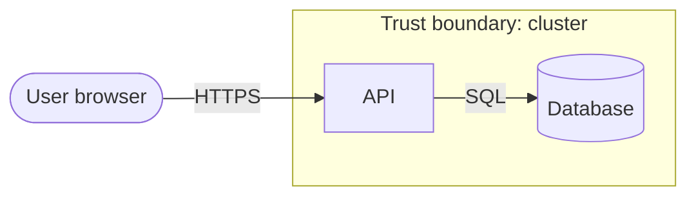

# Threat model: <system or change>

- **Date / authors / reviewers:**
- **Scope:** what's in, what's out

## 1. What are we building?
Short description, then a data-flow diagram:

**Assets** (from the CIA rating): …

## 2. What can go wrong? (STRIDE per element / flow)
| ID | Element / flow | STRIDE | Threat | Likelihood | Impact | Risk |
|---|---|---|---|---|---|---|
| T-1 | | | | | | |

## 3. What are we going to do about it?
| Threat | Decision (mitigate / eliminate / transfer / accept) | Control | Test that proves it | Finding |
|---|---|---|---|---|

## 4. Did we do a good job?
Open questions, assumptions, and when to revisit (e.g. "when the chatbot gets tool access").
